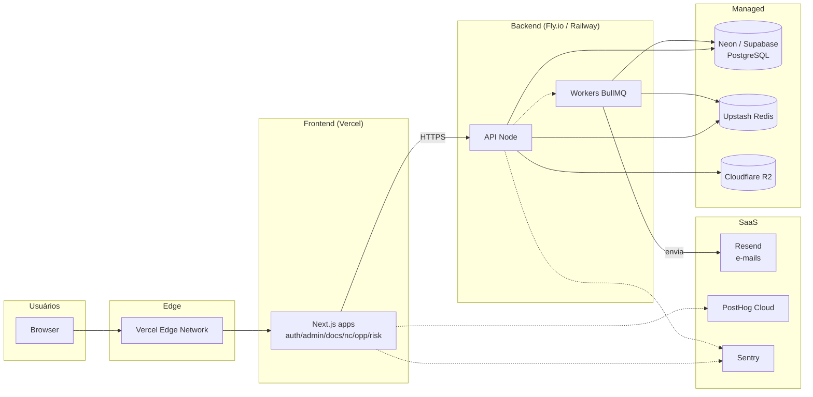
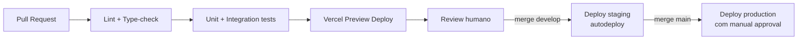

# Infraestrutura

## Topologia recomendada para o MVP

## Ambientes

| Ambiente | Branch | URL |
|---|---|---|
| **dev local** | qualquer feature branch | `localhost:3000`, `localhost:3001`, … |
| **staging** | `develop` | `*.staging.seven.app` |
| **production** | `main` | `*.seven.app` |

## CI/CD (GitHub Actions)

## Backups

- **PostgreSQL**: snapshot diário automático (Neon/Supabase) + retenção 30 dias.
- **Anexos (S3/R2)**: versionamento ativado no bucket.
- **Restore drill**: trimestral. Documentar tempo de RTO no runbook.

## Observabilidade

- **Erros**: Sentry (front + back).
- **Logs**: agregação em Grafana Loki (via stdout dos containers).
- **Métricas**: OpenTelemetry → Grafana Cloud / Prometheus.
- **Health checks**: `/health` em cada serviço, monitorado por uptime do Fly/Railway.
- **Dashboard SRE inicial**: latência p50/p95 por endpoint, taxa de erro 5xx, fila de e-mail backlog.

## Segurança baseline

- HTTPS only, HSTS preload.
- Cookie httpOnly + Secure + SameSite=Lax.
- CSP estrito (sem `unsafe-eval`, sem `unsafe-inline` onde possível).
- Rate limit no gateway (60 req/min por IP, 1000 req/min por usuário autenticado).
- Senhas com Argon2id; reset por e-mail com token de uso único expirando em 30min.
- Logs nunca contêm PII em texto pleno (mascarar e-mail, CPF, telefone).
- Backup de DB criptografado em repouso.

## Custos estimados (MVP, 1 tenant)

| Item | Custo/mês (USD) |
|---|---|
| Vercel Pro | $20 |
| Fly.io / Railway (API + worker) | $20–40 |
| Neon Postgres | $19 |
| Upstash Redis | $0–10 |
| R2 (storage) | $0–5 |
| Resend | $0 (free até 3k/mês) |
| PostHog | $0 (free até 1M eventos) |
| Sentry | $0–26 |
| **Total** | **~$60–120/mês** |
