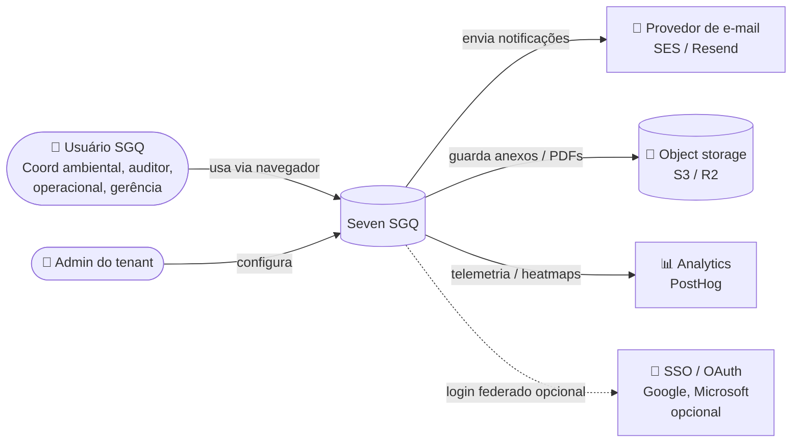

# Arquitetura — Contexto do sistema (C4 nível 1)

Visão de "30 mil pés": quem usa, com quê o sistema conversa.

## Atores

| Ator | Necessidades principais |
|---|---|
| **Coord. ambiental** | Cadastrar licenças, registrar ocorrências, gerar evidências |
| **Auditor interno** | Acessar histórico, exportar relatórios |
| **Operacional de campo** | Registrar ocorrências rápido (mobile-friendly) |
| **Gerência** | Dashboards, indicadores, KPIs |
| **Admin do tenant** | Cadastrar usuários, configurar processos/unidades, definir permissões |

## Sistemas externos

| Sistema | Tipo | Por quê |
|---|---|---|
| Provedor de e-mail | Saída | Notificações de tarefas, prazos, validade |
| Object storage | Saída/entrada | Anexos, PDFs publicados |
| PostHog | Saída | Telemetria de produto e session replay |
| SSO opcional | Entrada | Login federado para tenants enterprise |

## O que **não** está no escopo

- Integrações com SISNAMA / IBAMA / órgãos estaduais (futuro)
- Pagamentos / billing (módulo separado, fora deste sistema)
- Mobile nativo (mobile-first responsivo é suficiente para MVP)
