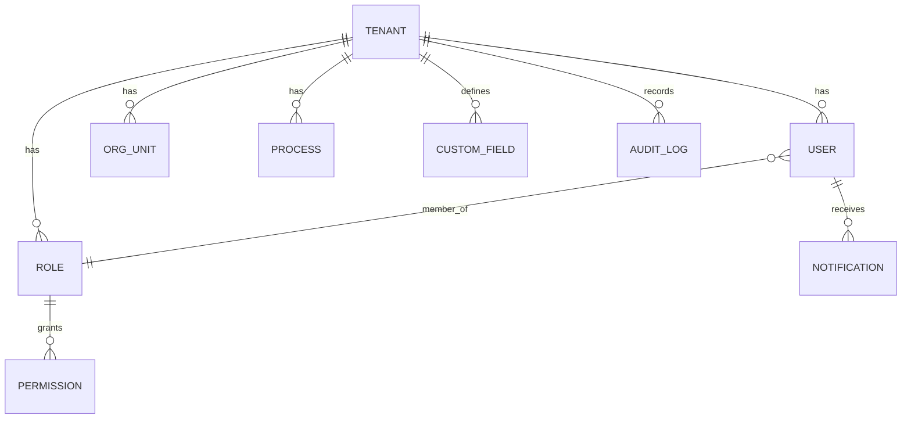
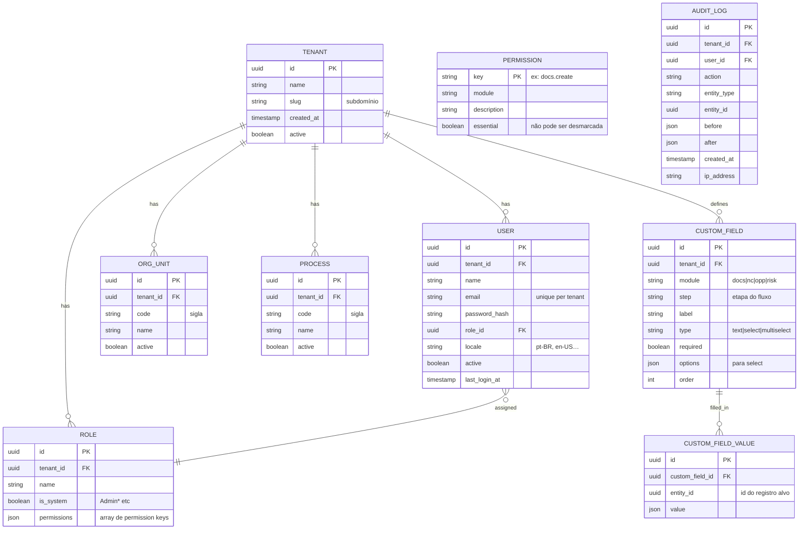
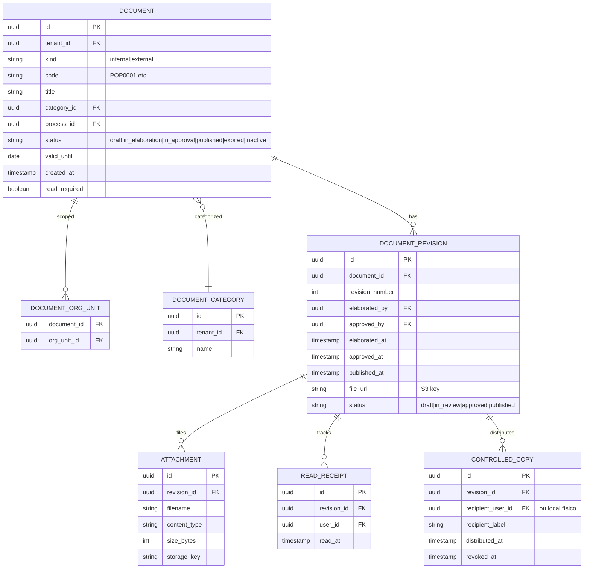
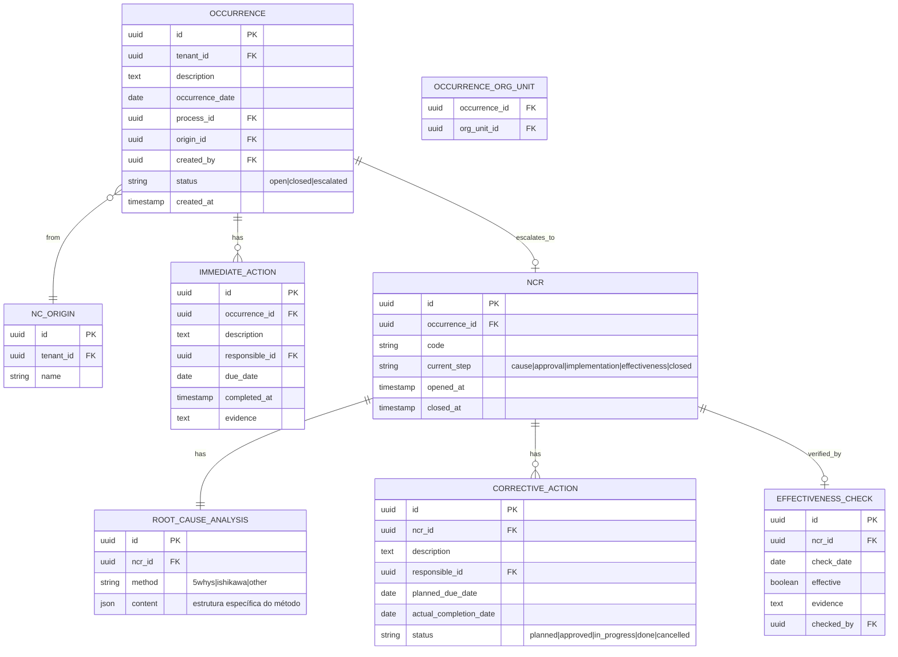
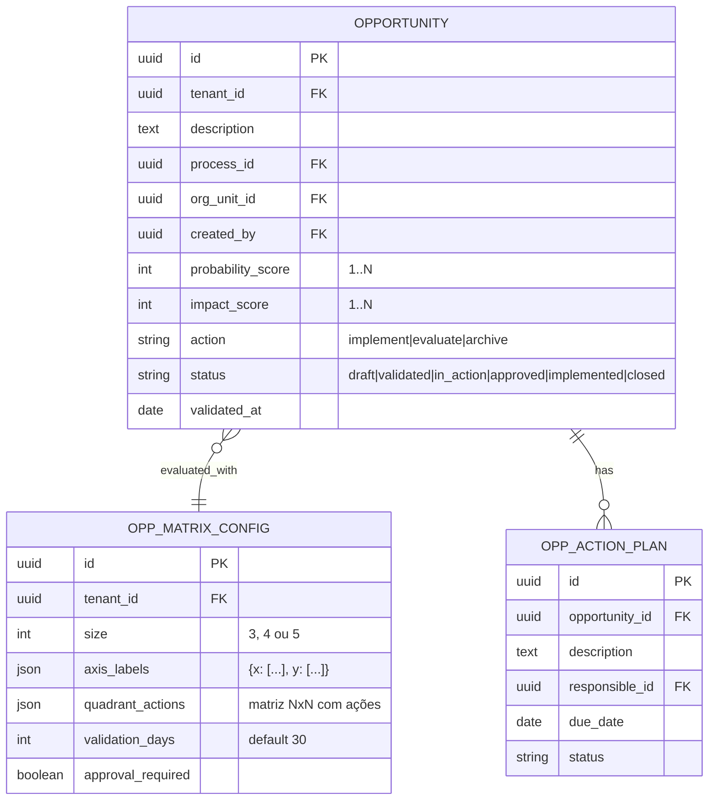
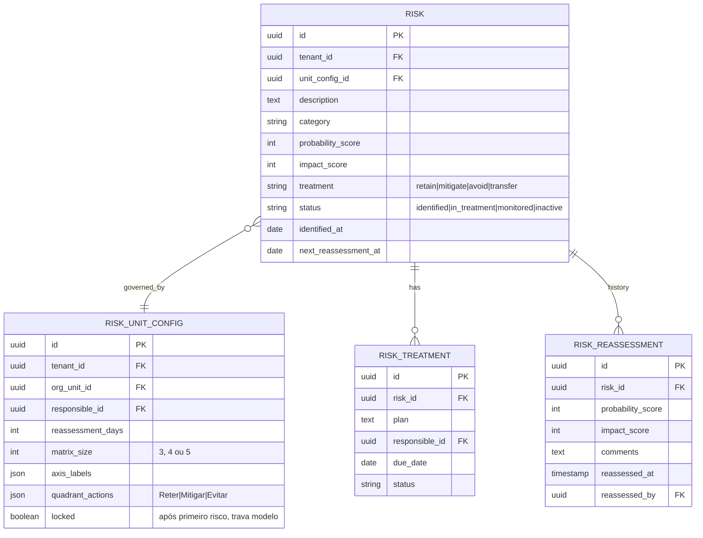

# Modelo de Dados — ERD

## Visão geral



## Espinha dorsal (Admin)



## Documentos



## Não Conformidades



## Oportunidades



## Riscos



## Multi-tenancy

Toda tabela de domínio carrega `tenant_id`. Uso de **PostgreSQL Row-Level Security (RLS)** com a policy:

```sql
CREATE POLICY tenant_isolation ON <table>
  USING (tenant_id = current_setting('app.tenant_id')::uuid);
```

`app.tenant_id` é setado pela API a cada conexão, baseado no JWT/cookie do usuário.

Detalhes em [`02-domain/multi-tenancy.md`](multi-tenancy.md).
