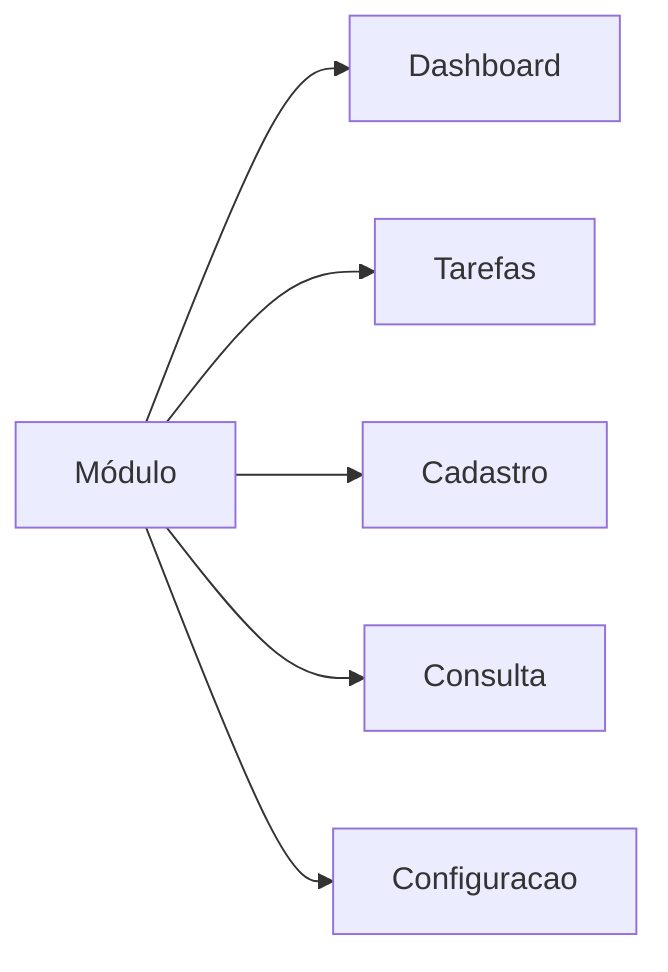
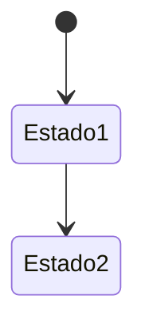

# Módulo: <Nome>

> Sub-domínio: `<modulo>.seven.app` · API: `<modulo>-api.seven.app/api`
> Owner: @<github-handle>

## 1. Propósito

Um parágrafo: o que esse módulo resolve, para quem, qual o "trabalho a ser feito".

## 2. Personas e permissões

Quem usa esse módulo e que permissões cada perfil tem. Linkar [`../02-domain/permissions-matrix.md`](../../02-domain/permissions-matrix.md).

## 3. Glossário do módulo

Termos específicos. Linkar para [`../02-domain/glossary.md`](../../02-domain/glossary.md) se já existir.

## 4. Sitemap



## 5. Entidades principais

ERD parcial (apenas o que é desse módulo). Linkar para [`../02-domain/erd.md`](../../02-domain/erd.md).

## 6. State machines

Estados de cada entidade relevante.



## 7. Fluxogramas dos processos

Diagrama de cada fluxo principal (cadastro, tratamento, encerramento…).

## 8. Telas

Para cada tela:

### Tela: <Nome>

**Path**: `/path/to/screen`
**Permissão**: `modulo.acao`

**Wireframe**:
```
┌──────────────────────────────────────┐
│ Header                               │
├──────────────────────────────────────┤
│ Conteúdo                             │
└──────────────────────────────────────┘
```

**Componentes**: Lista mestra, Wizard, Form, etc.
**Ações**: Criar, Editar, Excluir, Exportar…
**Estados**: vazio, carregando, erro, sucesso.

## 9. Endpoints

| Método | Path | Permissão | Body | Resposta |
|---|---|---|---|---|
| GET | `/api/...` | `modulo.read` | — | Array |

## 10. Eventos emitidos

| Evento | Trigger | Consumidor |
|---|---|---|
| `modulo.entity.created` | Criação de X | email-worker, audit |

## 11. Edge cases

- Caso A
- Caso B

## 12. Critérios de aceitação (Gherkin)

```gherkin
Feature: ...

  Scenario: ...
    Given ...
    When ...
    Then ...
```
