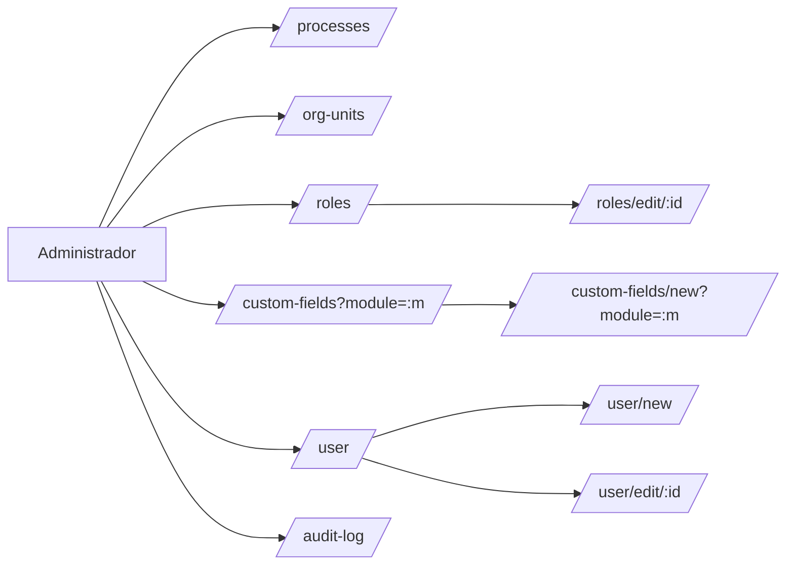
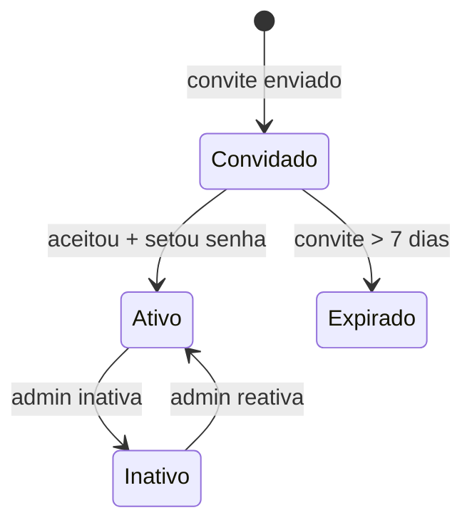
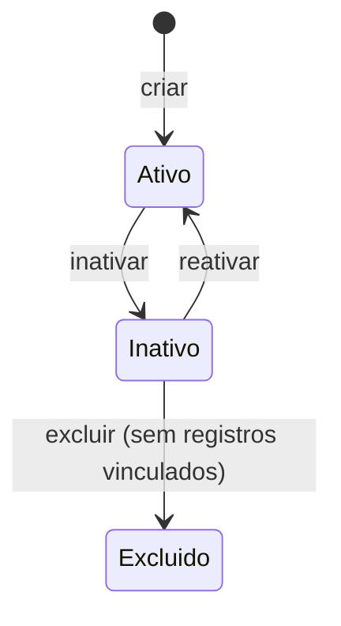

# Módulo: Administrador

> Sub-domínio: `admin.seven.app` · API: `admin-api.seven.app/api`

## 1. Propósito

Espinha dorsal do sistema. Configura **quem usa** (usuários, grupos), **onde** (unidades organizacionais), **em que área** (processos), e **com que dados extras** (campos personalizados). Também expõe o audit log.

Sem o Admin configurado, nenhum outro módulo funciona corretamente.

## 2. Personas

| Persona | Acesso típico |
|---|---|
| Admin do tenant | Acesso total |
| Coord. qualidade | Apenas leitura de processos/unidades |
| Outros | Sem acesso ao módulo |

## 3. Sitemap



## 4. Entidades

`TENANT`, `USER`, `ORG_UNIT`, `PROCESS`, `ROLE`, `PERMISSION`, `CUSTOM_FIELD`, `AUDIT_LOG`.

ERD: ver [`../../02-domain/erd.md`](../../02-domain/erd.md#espinha-dorsal-admin).

## 5. State machines

### Usuário



### Processo / Unidade Organizacional



## 6. Telas

### Lista de Processos

**Path**: `/processes`
**Permissão**: implícita (essencial)

```
┌─────────────────────────────────────────────────────────────┐
│ TopBar                                                       │
├─────────────────────────────────────────────────────────────┤
│ Processos                       [+ Adicionar processo] [Filtros] │
│ Total: 5                                                     │
│ ┌──────┬─────────────┬─────────────┬─────────┬──────────┐  │
│ │ Sigla│ Nome        │ Data registro│ Editar  │ Ativar  │  │
│ │ -    │ Vendas      │ 27/04/2026  │   ✏     │   👁    │  │
│ └──────┴─────────────┴─────────────┴─────────┴──────────┘  │
└─────────────────────────────────────────────────────────────┘
```

**Componentes**: lista mestra com sort por coluna, filtros laterais, paginação.

### Editar Grupo de Permissões

**Path**: `/roles/edit/:id`
**Permissão**: `admin.roles.update`

Layout 2 abas: **Permissões** (árvore por módulo) + **Usuários** (membros).

Permissões essenciais ficam disabled. UI agrupa visualmente por módulo: Administrador, Documentos, NC, Oportunidades, Riscos.

### Cadastrar/Editar Usuário

**Path**: `/user/new` ou `/user/edit/:id`

Campos: Nome (max 100), E-mail, Senha + Confirmação (apenas no novo), Grupo de permissões, Idioma (pt-BR / en-US / es-ES).

### Campos Personalizados

**Path**: `/custom-fields?module=:m`

Wizard 2 passos:
1. **Local**: Módulo + Etapa (depende do módulo)
2. **Configurações**: Tipo (Parágrafo / Seleção única / Seleção múltipla), Obrigatório, Rótulo, Opções (se select)

## 7. Endpoints

| Método | Path | Permissão |
|---|---|---|
| GET | `/api/users` | `admin.users.read` |
| POST | `/api/users` | `admin.users.create` |
| PATCH | `/api/users/:id` | `admin.users.update` |
| POST | `/api/users/:id/deactivate` | `admin.users.deactivate` |
| GET | `/api/roles` | `admin.roles.read` |
| POST | `/api/roles` | `admin.roles.create` |
| PATCH | `/api/roles/:id` | `admin.roles.update` |
| DELETE | `/api/roles/:id` | `admin.roles.delete` |
| GET | `/api/processes` | implícita |
| POST | `/api/processes` | `admin.processes.create` |
| GET | `/api/org-units` | implícita |
| POST | `/api/org-units` | `admin.org_units.create` |
| GET | `/api/custom-fields?module=` | `admin.custom_fields.update` |
| POST | `/api/custom-fields` | `admin.custom_fields.create` |
| GET | `/api/audit-log?...` | `admin.audit.read` |

## 8. Edge cases

- Excluir grupo "Admin*" — proibido (essencial).
- Excluir grupo com usuários ativos — exigir reatribuição antes.
- Inativar usuário com tarefas em aberto — alerta antes, mantém tarefas mas bloqueia login.
- Excluir Processo/Unidade vinculada a documentos/NCs — bloquear. Apenas inativar.
- Mudar idioma do usuário — recarrega app no novo locale.

## 9. Critérios de aceitação

```gherkin
Feature: Cadastrar usuário

  Scenario: Cadastro válido
    Given que sou Admin do tenant
    When acesso "Novo usuário"
      And preencho Nome, E-mail, Senha, Grupo, Idioma
      And clico em "Gravar"
    Then o usuário é criado com status "Ativo"
      And recebe e-mail de boas-vindas
      And aparece na lista com badge do grupo

  Scenario: E-mail duplicado no mesmo tenant
    Given que existe usuário com e-mail "x@y.com" no tenant
    When tento cadastrar outro com o mesmo e-mail
    Then recebo erro "E-mail já em uso neste tenant"

Feature: Excluir grupo de permissões

  Scenario: Grupo com membros
    Given grupo "Auditores" tem 3 usuários
    When tento excluir
    Then recebo erro "Reatribua os 3 usuários antes de excluir"
```
