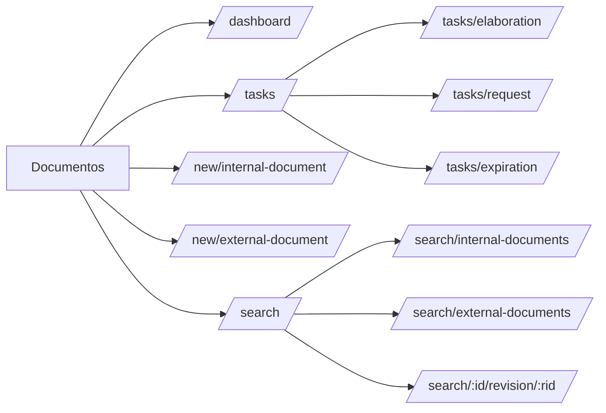
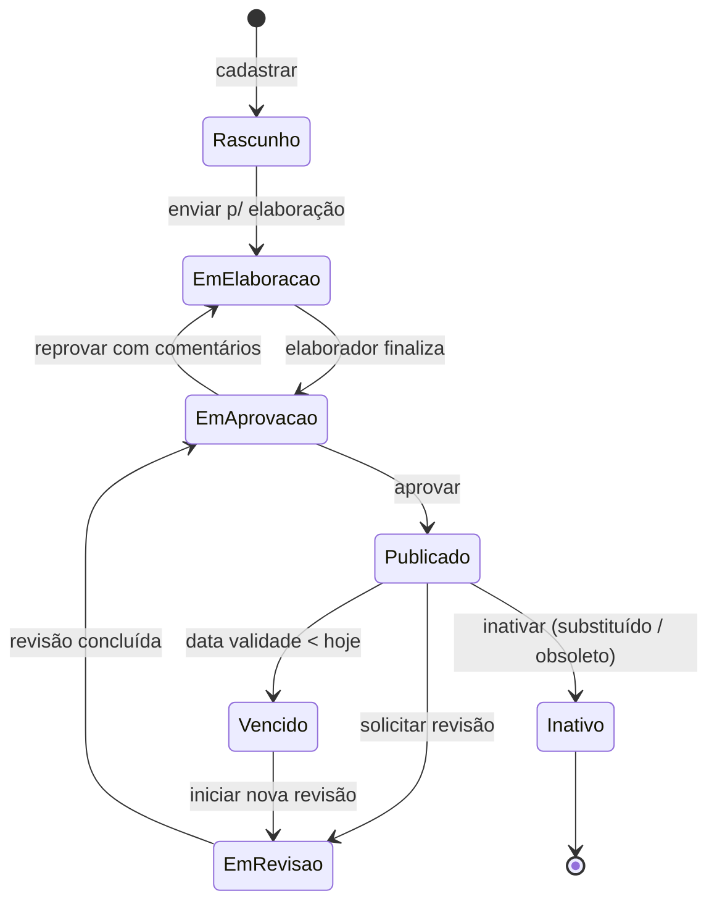
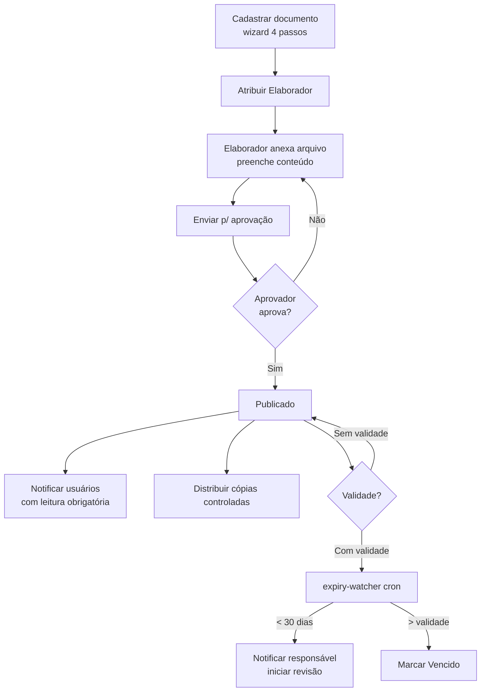

# Módulo: Documentos

> Sub-domínio: `docs.seven.app` · API: `docs-api.seven.app/api`

## 1. Propósito

Controle do ciclo de vida de **documentos do SGQ** (procedimentos, políticas, manuais, normas, registros) e **documentos externos** (licenças, certificados, normas técnicas). Gerencia versão, validade, leitura obrigatória e cópia controlada.

## 2. Personas

| Persona | O que faz aqui |
|---|---|
| Coord. qualidade | Cadastra, revisa, aprova documentos internos |
| Operacional | Consulta documentos vigentes, marca leitura |
| Auditor | Consulta histórico, exporta lista mestra |
| Admin | Distribui cópias controladas, configura categorias |

## 3. Glossário

Ver [`../../02-domain/glossary.md#documentos`](../../02-domain/glossary.md#documentos).

## 4. Sitemap



## 5. State machine — Documento



## 6. Fluxograma — ciclo completo (interno)



## 7. Telas

### Dashboard

**Path**: `/dashboard` · **Permissão**: `docs.dashboard.read`

Filtros globais: Unidades organizacionais, Processos.

Widgets:
1. Status das tarefas de elaboração (gráfico por etapa)
2. Tarefas de solicitação por tipo
3. Tarefas de validade por status
4. Documentos por tipo / status / unidade / processo / categoria / período

### Tarefas

**Path**: `/tasks/elaboration` (default), `/tasks/request`, `/tasks/expiration`

Lista filtrada pelo `responsibleIds` (default = user atual). Permissão `docs.tasks.read_all` permite ver de outros.

### Cadastrar Documento Interno (wizard 4 passos)

**Path**: `/new/internal-document` · **Permissão**: `docs.internal.create`

```
┌─ 1. Informações ─┬─ 2. Responsável ─┬─ 3. Doc. associados ─┬─ 4. Configuração ─┐

[1] Informações
   Título * (max 500)
   Categoria *
   Unidades organizacionais * (multi)
   Processo *
   Número sequencial    Revisão * (default 0)

[2] Responsável
   Elaborador *
   Aprovador *

[3] Documentos associados (opcional)
   [+] Vincular outros documentos

[4] Configuração (opcional)
   Validade (data ou periodicidade)
   Leitura obrigatória [toggle]
   Notificação prévia X dias antes da validade
```

### Cadastrar Documento Externo

**Path**: `/new/external-document` · **Permissão**: `docs.external.create`

Variante mais simples: foco em arquivo + validade. Não tem ciclo de elaboração interno.

### Consulta — Lista Mestra

**Path**: `/search/internal-documents` · **Permissão**: `docs.read`

Colunas: Resumo · Código · Documento · Categoria · Unidades · Processo · Status · Validade · Última revisão.

Botões: **Controle de leitura obrigatória** · Filtro · "⋮" (exportar, ações em massa).

### Detalhe do Documento

**Path**: `/search/:documentId/revision/:revisionId?showDetails=true`

Layout duas colunas:
- Esquerda: visualizador PDF (PDF.js) com paginação, zoom, rotação, fullscreen.
- Direita: painel com seções colapsáveis:
  - Ações: **Editar cadastro · Revisar · Inativar**
  - Informações Básicas (Processo, Unidades, Categoria, Validade)
  - Anexos
  - Revisões (histórico)
  - Responsáveis (Elaboração, Aprovação)
  - Visualizações (quem leu)
  - Controle (cópias controladas)
  - Compartilhar

## 8. Endpoints

| Método | Path | Permissão |
|---|---|---|
| GET | `/api/dashboards/elaboration-tasks-by-stage` | `docs.dashboard.read` |
| GET | `/api/dashboards/request-tasks-by-type` | `docs.dashboard.read` |
| GET | `/api/dashboards/expiration-tasks-by-status` | `docs.dashboard.read` |
| GET | `/api/dashboards/documents-by-{type,status,organizational-unit,process,category,period}` | `docs.dashboard.read` |
| GET | `/api/documents?kind=internal|external&...` | `docs.read` |
| POST | `/api/documents` | `docs.internal.create` ou `docs.external.create` |
| PATCH | `/api/documents/:id` | `docs.update` |
| DELETE | `/api/documents/:id` | `docs.delete` |
| POST | `/api/documents/:id/revisions` | `docs.update` |
| POST | `/api/revisions/:id/submit` | `docs.update` |
| POST | `/api/revisions/:id/approve` | (responsável aprovador) |
| POST | `/api/revisions/:id/reject` | (responsável aprovador) |
| POST | `/api/revisions/:id/mark-read` | autenticado |
| POST | `/api/documents/:id/controlled-copies` | `docs.read_required.manage` |
| DELETE | `/api/controlled-copies/:id` | `docs.controlled_copy.delete` |
| GET | `/api/tasks?type=elaboration|request|expiration` | autenticado |
| GET | `/api/audit-log?entity=document` | `docs.audit.read` |

## 9. Eventos / notificações

| Evento | Trigger | Notifica |
|---|---|---|
| `docs.elaboration.assigned` | Doc enviado para elaboração | Elaborador (in-app + e-mail) |
| `docs.approval.assigned` | Elaborador finaliza | Aprovador |
| `docs.published` | Aprovador aprova | Lista de leitura obrigatória |
| `docs.read_required` | Doc publicado com flag | Lista de usuários alvo |
| `docs.expiring_soon` | Cron: validade < 30d | Responsável |
| `docs.expired` | Cron: hoje > validade | Responsável + admin |

## 10. Edge cases

- Versão atual em revisão **+** documento publicado: usuários veem o publicado, novos leitores são notificados quando a nova revisão for aprovada.
- Inativar documento com cópias controladas distribuídas: forçar revogação primeiro (via `docs.controlled_copy.delete`).
- Substituir arquivo já publicado (`docs.published_file.replace`): grava no audit log com `before/after` do storage_key. Não muda número da revisão.
- Documento sem categoria: bloqueado pelo schema. Categorias devem ser pré-cadastradas pelo Admin.

## 11. Critérios de aceitação

```gherkin
Feature: Ciclo elaboração → publicação

  Scenario: Aprovação simples
    Given um documento criado em estado "Rascunho"
      And com Elaborador "Ana" e Aprovador "Bruno"
    When Ana anexa arquivo e clica "Enviar para aprovação"
    Then estado vira "Em aprovação"
      And Bruno recebe notificação
    When Bruno clica "Aprovar"
    Then estado vira "Publicado"
      And aparece na Consulta com revisão "00"

  Scenario: Validade próxima do vencimento
    Given documento "Licença CETESB 123" com validade em 25 dias
    When o cron expiry-watcher roda
    Then o responsável recebe e-mail "Validade próxima"
      And aparece na aba Tarefas → Validade
```
