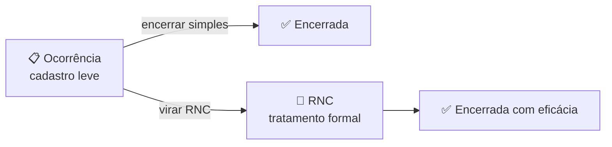
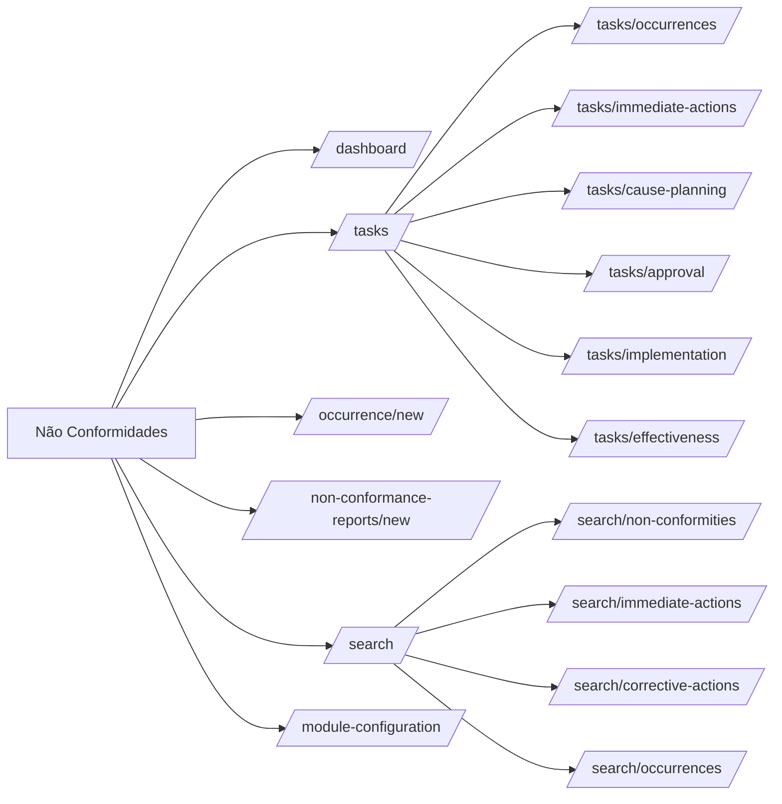
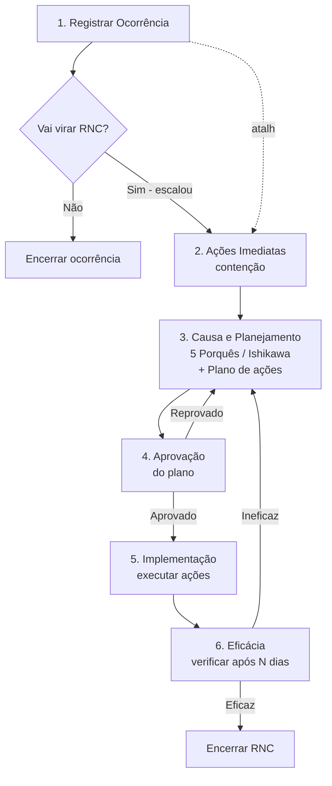
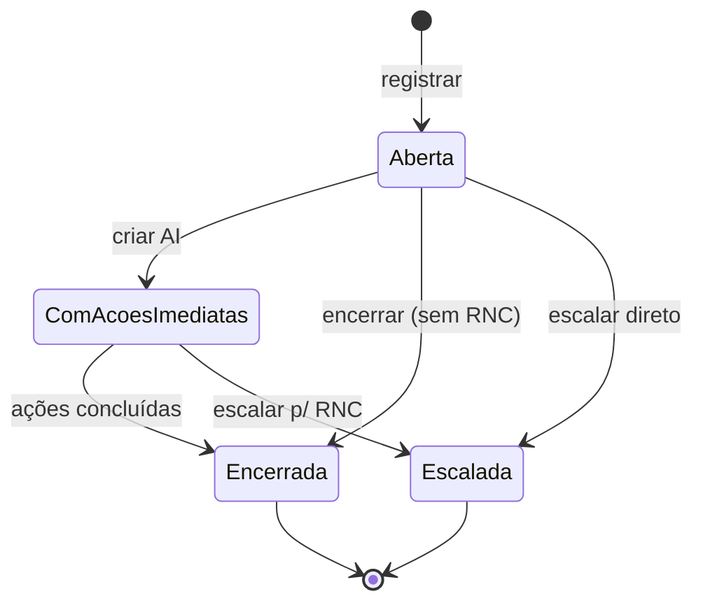
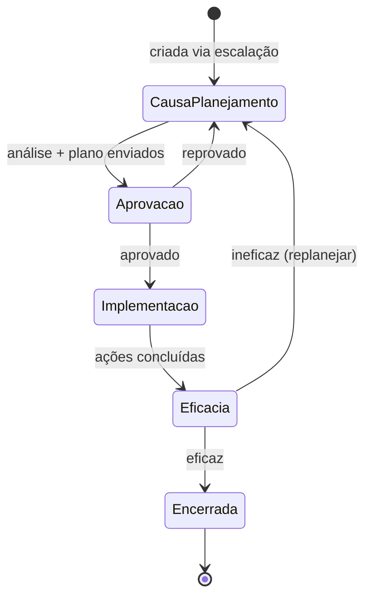

# Módulo: Não Conformidades

> Sub-domínio: `nc.seven.app` · API: `nc-api.seven.app/api`

## 1. Propósito

Capturar e tratar **eventos não conformes** ao SGQ/SGA. Distingue entre **Ocorrência** (registro inicial leve) e **RNC** (tratamento formal completo). Aplica análise de causa, plano de ação corretivo e verificação de eficácia.

## 2. Personas

| Persona | O que faz |
|---|---|
| Operacional | Registra ocorrências (visão simples e rápida) |
| Coord. qualidade | Triagem, escala para RNC, conduz tratamento |
| Especialista técnico | Faz análise de causa (5 Porquês, Ishikawa) |
| Aprovador (gerência) | Aprova plano de ação |
| Auditor | Consulta histórico, verifica eficácia |

## 3. Conceito-chave: Ocorrência ≠ RNC



A maioria dos eventos do dia-a-dia fica como **Ocorrência**. Só viram **RNC** quando há requisito de norma ou impacto significativo.

## 4. Sitemap



## 5. Fluxograma — fluxo completo de RNC



## 6. State machines

### Ocorrência



### RNC



## 7. Entidades

`OCCURRENCE`, `NC_ORIGIN`, `IMMEDIATE_ACTION`, `NCR`, `ROOT_CAUSE_ANALYSIS`, `CORRECTIVE_ACTION`, `EFFECTIVENESS_CHECK`.

ERD: ver [`../../02-domain/erd.md#não-conformidades`](../../02-domain/erd.md#nao-conformidades).

## 8. Telas

### Dashboard

**Path**: `/dashboard` · **Permissão**: `nc.dashboard.read`

Filtros globais: Unidades, Processos, **Origem**.

Widgets:
- Status das tarefas das NCs (por etapa do fluxo)
- NCs por unidade / processo / origem / período
- **Eficácia das ações por período** (KPI-chave)
- Ocorrências por unidade / processo / origem / período
- Ocorrências encerradas por período

### Registrar Ocorrência (wizard 2 passos)

**Path**: `/occurrence/new` · **Permissão**: `nc.occurrence.create`

```
[1] Detalhes
   Descrição * (max 3000)
   Data da ocorrência *
   Unidades organizacionais * (multi)
   Processos *
   Origem *
   Notificar usuários por e-mail [chips]
   Anexos [drag & drop]

[2] Ações imediatas (opcional)
   [+] AI 1: descrição, responsável, prazo
   [+] AI 2: ...
```

### Registrar Não Conformidade (RNC)

**Path**: `/nonconformance-reports/new` · **Permissão**: `nc.rnc.create`

Wizard mais longo (estimativa, validar com produto):
1. **Descrição** (vincular a ocorrência existente OU descrever do zero)
2. **Análise de causa** (escolher método: 5 Porquês ou Ishikawa, preencher)
3. **Plano de ação** (lista de ações corretivas com responsável + prazo)
4. **Verificação prévia** (data prevista da verificação de eficácia)

### Consulta

**Path**: `/search/non-conformities` (default) · **Permissão**: `nc.rnc.read`

Dropdown com 4 visões:
- Não conformidades
- Ações imediatas
- Ações corretivas
- Ocorrências

### Configuração do módulo

**Path**: `/module-configuration` · **Permissão**: `nc.config.update`

- Origens: CRUD de taxonomia (Auditoria, Reclamação cliente, Inspeção, Indicador, Outro)
- Métodos de análise habilitados: 5 Porquês, Ishikawa, ambos
- Prazo padrão de eficácia (dias)
- Aprovador padrão (opcional)

## 9. Endpoints

| Método | Path | Permissão |
|---|---|---|
| GET | `/api/dashboard/non-conformance-reports-tasks-by-step` | `nc.dashboard.read` |
| GET | `/api/dashboard/non-conformance-reports-by-{organizational-unit,process,origin,period}` | `nc.dashboard.read` |
| GET | `/api/dashboard/non-conformance-reports-effectiveness-by-period` | `nc.dashboard.read` |
| GET | `/api/dashboard/occurrences-{tasks-by-type,by-organizational-unit,by-process,by-origin,by-period,closed-by-period}` | `nc.dashboard.read` |
| POST | `/api/occurrences` | `nc.occurrence.create` |
| GET | `/api/occurrences?...` | `nc.rnc.read` |
| PATCH | `/api/occurrences/:id` | `nc.occurrence.update_delete` |
| POST | `/api/occurrences/:id/close` | `nc.occurrence.close` |
| POST | `/api/occurrences/:id/escalate` | `nc.rnc.create` |
| POST | `/api/immediate-actions` | autenticado (responsável da occurrence) |
| POST | `/api/non-conformance-reports` | `nc.rnc.create` |
| GET | `/api/non-conformance-reports?...` | `nc.rnc.read` |
| PATCH | `/api/non-conformance-reports/:id` | `nc.rnc.update_open` |
| POST | `/api/non-conformance-reports/:id/submit-plan` | (responsável) |
| POST | `/api/non-conformance-reports/:id/approve` | (aprovador) |
| POST | `/api/non-conformance-reports/:id/reject` | (aprovador) |
| POST | `/api/corrective-actions/:id/complete` | (responsável da AC) |
| POST | `/api/non-conformance-reports/:id/effectiveness` | (verificador) |
| GET | `/api/origins` | autenticado |
| POST | `/api/origins` | `nc.origin.create` |

## 10. Eventos / notificações

| Evento | Trigger | Notifica |
|---|---|---|
| `nc.occurrence.created` | POST occurrence | Lista de notificados + responsável |
| `nc.immediate_action.assigned` | AI criada | Responsável da AI |
| `nc.escalated_to_rncr` | Ocorrência vira RNC | Responsável RNC + admin |
| `nc.rnc.plan_submitted` | Plano enviado | Aprovador |
| `nc.rnc.plan_approved` | Aprovado | Responsáveis das ações |
| `nc.corrective_action.due_soon` | Cron: prazo < 3d | Responsável |
| `nc.effectiveness.due` | Cron: chegou data | Verificador |
| `nc.rnc.closed` | Eficaz | Solicitante + cadeia |

## 11. Edge cases

- **Ocorrência sem origem**: bloqueado (origem obrigatória).
- **Origem em uso**: não pode ser excluída.
- **Excluir RNC já em "Implementação"**: proibido. Apenas cancelar com justificativa (vai pro audit).
- **Mesma ocorrência → várias RNCs**: permitido (raro), modelo é 1:N na realidade (refatorar `OCCURRENCE → NCR` para 1:N quando aparecer).
- **5 Porquês com menos de 5 níveis**: permitido com justificativa.
- **Ineficaz após 3 ciclos**: gera flag para revisão de processo (futuro).

## 12. Critérios de aceitação

```gherkin
Feature: Registrar ocorrência

  Scenario: Registro mínimo
    Given que tenho permissão "nc.occurrence.create"
    When acesso "Registrar ocorrência"
      And preencho Descrição "Vazamento de óleo"
      And seleciono Data, Unidade, Processo, Origem
      And clico "Criar ações imediatas"
    Then a ocorrência fica em estado "Aberta"
      And aparece em Tarefas → Ocorrências
      And o audit log registra a ação

Feature: Verificação de eficácia

  Scenario: Marcar como eficaz fecha a RNC
    Given uma RNC em estado "Eficácia"
      And que sou o verificador
    When acesso a RNC e marco "Eficaz" com evidência
    Then a RNC vira "Encerrada"
      And o solicitante recebe notificação
      And aparece no widget "Eficácia das ações por período"

  Scenario: Marcar como ineficaz volta para Causa e Planejamento
    Given uma RNC em estado "Eficácia"
    When marco "Ineficaz" com justificativa
    Then a RNC volta para "Causa e Planejamento"
      And os responsáveis são notificados para replanejar
```
