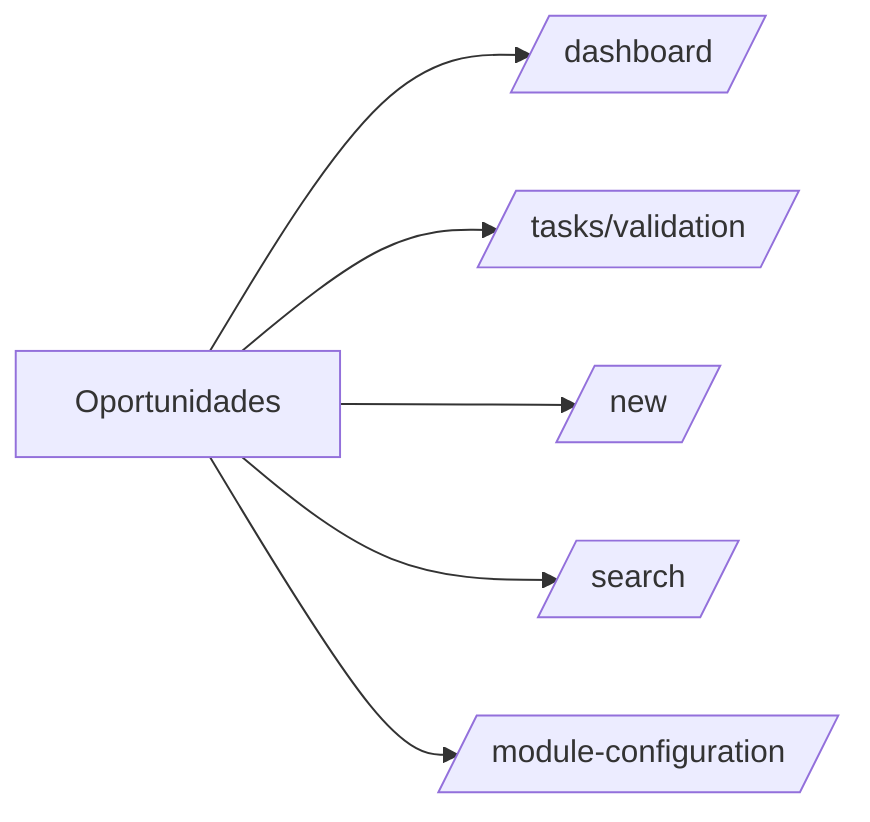
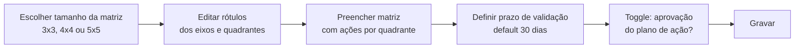
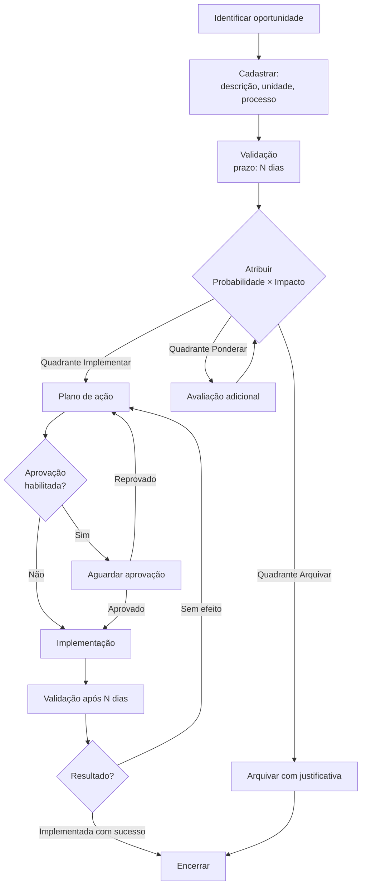
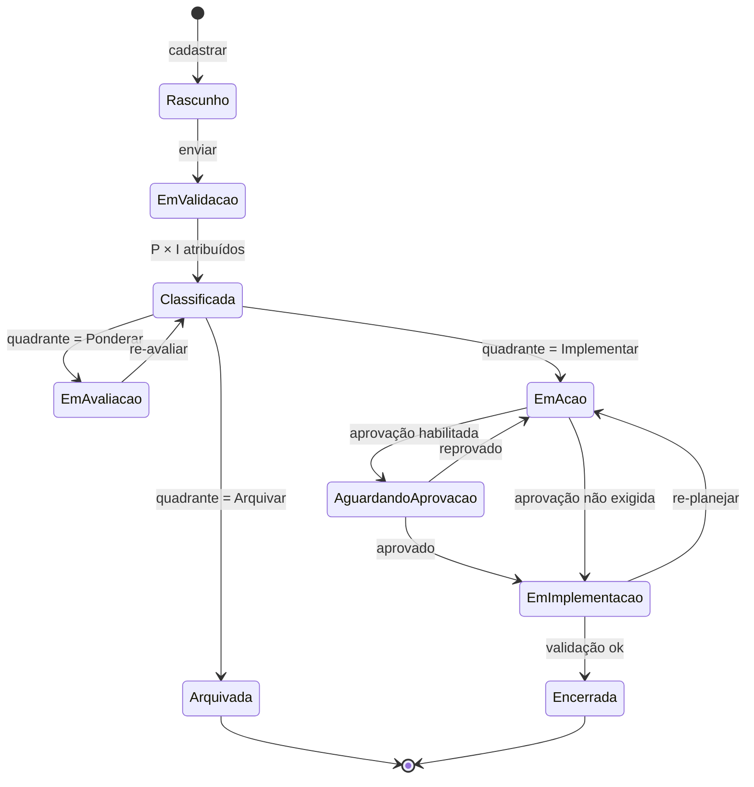

# Módulo: Oportunidades de Melhoria

> Sub-domínio: `opp.seven.app` · API: `opp-api.seven.app/api`

## 1. Propósito

Capturar e priorizar **oportunidades de melhoria** de processo, produto ou sistema. Aplica matriz **Probabilidade × Impacto** para classificar e definir ação (Implementar / Ponderar / Arquivar). Aderente aos requisitos de melhoria contínua da ISO 9001.

## 2. Personas

| Persona | O que faz |
|---|---|
| Operacional | Sugere oportunidades |
| Coord. qualidade | Valida e prioriza |
| Gerência | Aprova plano de ação (se habilitado) |
| Responsáveis de ação | Implementam |

## 3. Sitemap



## 4. Configuração obrigatória

Antes do primeiro uso, é necessário rodar a **Configuração do Módulo** em `/module-configuration`:



⚠️ **Após primeira oportunidade cadastrada**, só é possível editar **rótulos** — o tamanho da matriz fica travado.

### Modelo da matriz padrão (3x3)

| Probabilidade ↓ \ Impacto → | Baixo | Moderado | Alto |
|---|---|---|---|
| **Alta** | Ponderar | Ponderar | **Implementar** |
| **Moderada** | Arquivar | Ponderar | Ponderar |
| **Baixa** | Arquivar | Arquivar | Ponderar |

Cores sugeridas:
- 🟩 Implementar (verde)
- 🟨 Ponderar (amarelo)
- 🟥 Arquivar (vermelho)

## 5. Fluxograma — ciclo da oportunidade



## 6. State machine — Oportunidade



## 7. Entidades

`OPP_MATRIX_CONFIG`, `OPPORTUNITY`, `OPP_ACTION_PLAN`.

ERD: ver [`../../02-domain/erd.md#oportunidades`](../../02-domain/erd.md#oportunidades).

## 8. Telas

### Configuração do módulo

**Path**: `/module-configuration` · **Permissão**: `opp.config.update`

- Tamanho: radio (3x3 / 4x4 / 5x5)
- Editor da matriz: clique numa célula → escolher ação (Implementar / Ponderar / Arquivar). Drag-to-paint útil.
- Editor dos rótulos: lista editável dos eixos.
- Inputs: prazo de validação (dias), toggle "Adicionar etapa de aprovação do plano de ação".

### Tarefas

**Path**: `/tasks/validation` · **Permissão**: `opp.read` (filtro = user)

Visão de oportunidades pendentes para o usuário corrente.

### Nova oportunidade

**Path**: `/new` · **Permissão**: `opp.create`

Wizard 2 passos:
1. **Identificação**: Descrição, Unidade, Processo, Solicitante
2. **Avaliação inicial**: Probabilidade (1..N) + Impacto (1..N) → mostra ação sugerida pela matriz

### Consulta

**Path**: `/search` · **Permissão**: `opp.read`

Lista mestra com colunas: Código, Descrição (truncada), Unidade, Processo, P × I, Ação, Status, Solicitante, Data.

## 9. Endpoints

| Método | Path | Permissão |
|---|---|---|
| GET | `/api/dashboard/...` | `opp.dashboard.read` |
| GET | `/api/matrix-config` | autenticado |
| PUT | `/api/matrix-config` | `opp.config.update` |
| POST | `/api/opportunities` | `opp.create` |
| GET | `/api/opportunities?...` | `opp.read` |
| PATCH | `/api/opportunities/:id` | `opp.update` |
| POST | `/api/opportunities/:id/validate` | `opp.validate` |
| POST | `/api/opportunities/:id/score` | `opp.update` |
| POST | `/api/opportunities/:id/action-plan` | `opp.update` |
| POST | `/api/action-plans/:id/approve` | (aprovador) |
| POST | `/api/action-plans/:id/complete` | (responsável) |
| POST | `/api/opportunities/:id/close` | `opp.update` |

## 10. Eventos

| Evento | Notifica |
|---|---|
| `opp.created` | Validador (coord. qualidade) |
| `opp.scored` | Solicitante (deu match com qual quadrante) |
| `opp.action_plan.submitted` | Aprovador (se habilitado) |
| `opp.action_due_soon` | Responsável |
| `opp.closed` | Solicitante |

## 11. Edge cases

- **Mudar tamanho da matriz com oportunidades existentes**: bloqueado. Mostrar erro com instrução para arquivar todas e recriar.
- **Editar rótulos com oportunidades existentes**: permitido (não muda scoring numérico, só labels).
- **Score 0 ou fora da escala**: bloqueado pelo schema.

## 12. Critérios de aceitação

```gherkin
Feature: Configurar matriz inicial

  Scenario: Setup completo
    Given matriz não configurada
    When acesso "Configuração do módulo"
      And escolho tamanho 3x3
      And edito rótulos dos eixos
      And atribuo ação a cada um dos 9 quadrantes
      And defino prazo 30 dias
      And clico "Gravar"
    Then a configuração é salva
      And o módulo libera "Nova oportunidade"

Feature: Oportunidade quadrante Implementar

  Scenario: Score Alta×Alto cai em Implementar
    Given matriz 3x3 configurada com Alta×Alto = Implementar
    When cadastro oportunidade com P=Alta, I=Alto
    Then o sistema sugere ação "Implementar"
      And gera task para criar plano de ação
```
