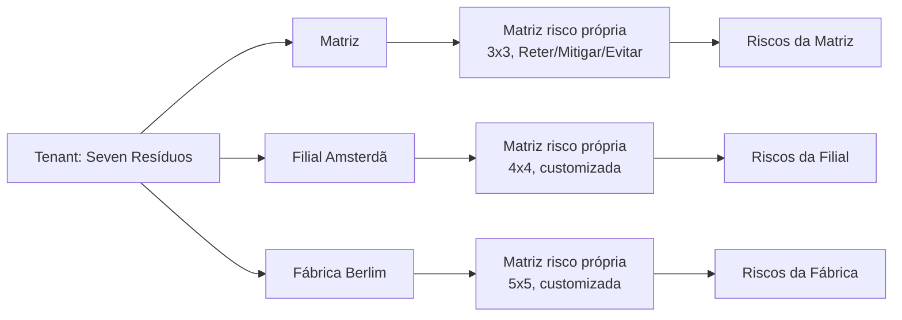
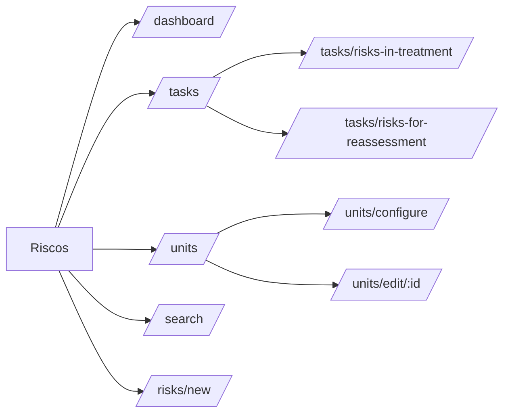
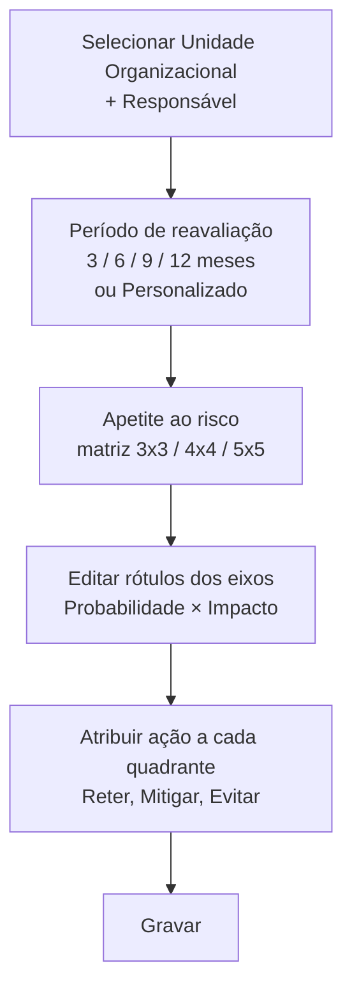
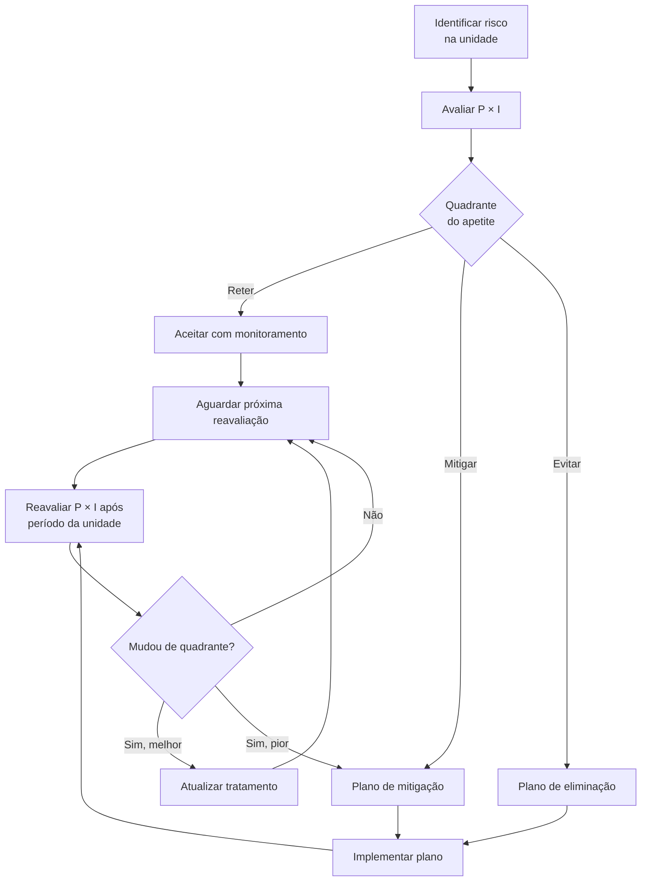
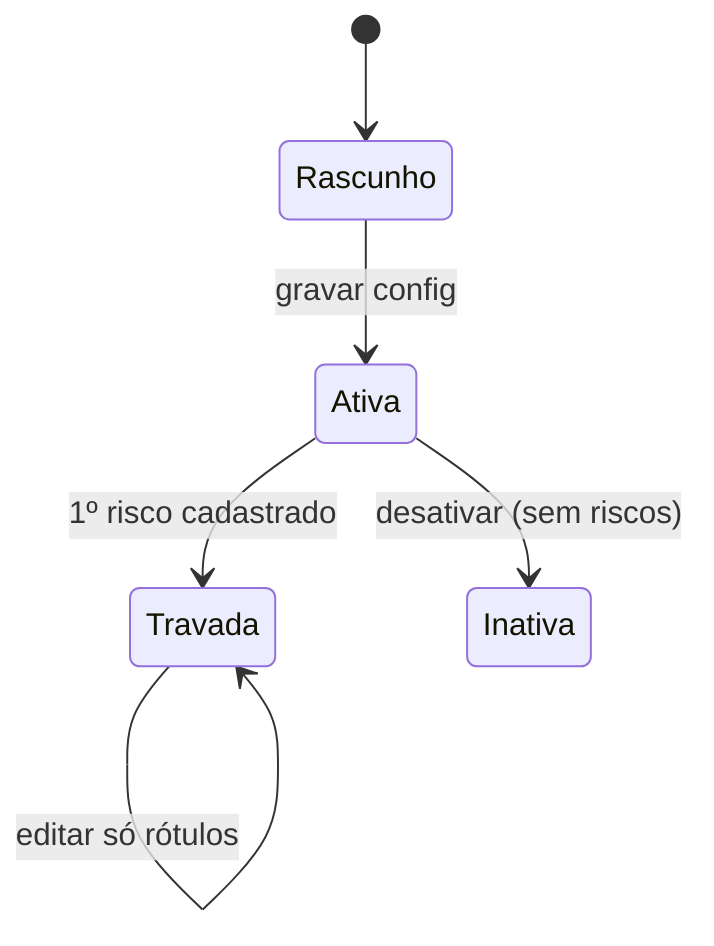
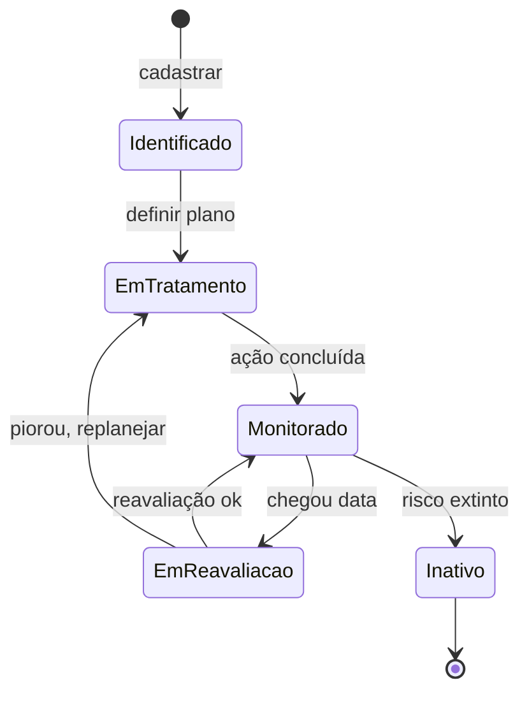

# Módulo: Riscos

> Sub-domínio: `risk.seven.app` · API: `risk-api.seven.app/api`

## 1. Propósito

Identificação, avaliação, tratamento e reavaliação de **riscos ambientais e operacionais**, aderente à **ISO 31000**. Tem característica única: **configuração por unidade organizacional** — cada filial/fábrica tem sua própria matriz de apetite ao risco.

## 2. Personas

| Persona | O que faz |
|---|---|
| Coord. ambiental | Identifica riscos, define tratamento |
| Responsável da unidade | Aprova matriz da unidade, é dono dos riscos |
| Auditor | Consulta histórico, verifica reavaliações |

## 3. Característica chave: configuração POR unidade



Cada unidade tem responsável dedicado e período de reavaliação próprio.

## 4. Sitemap



## 5. Configuração da unidade (wizard 3 blocos)



⚠️ Após primeiro risco identificado na unidade, **modelo do apetite trava** (não muda mais o tamanho).

### Modelo da matriz de apetite (3x3 padrão)

| Probabilidade ↓ \ Impacto → | Baixo | Moderado | Alto |
|---|---|---|---|
| **Alta** | Mitigar | Evitar | Evitar |
| **Moderada** | Reter | Mitigar | Evitar |
| **Baixa** | Reter | Reter | Mitigar |

Tratamentos clássicos: **Reter** (aceitar) · **Mitigar** (reduzir prob/impacto) · **Evitar** (eliminar). 5x5 pode incluir **Transferir** e **Compartilhar**.

## 6. Fluxograma — ciclo do risco



## 7. State machines

### Configuração da unidade



### Risco



## 8. Entidades

`RISK_UNIT_CONFIG`, `RISK`, `RISK_TREATMENT`, `RISK_REASSESSMENT`.

ERD: ver [`../../02-domain/erd.md#riscos`](../../02-domain/erd.md#riscos).

## 9. Telas

### Lista de Unidades

**Path**: `/units` · **Permissão**: autenticado

Estado vazio → CTA "Iniciar configuração de unidade".
Estado preenchido → cards/tabela com cada unidade configurada e indicadores (qtd. riscos, qtd. para reavaliar).

### Configuração da unidade

**Path**: `/units/configure` ou `/units/edit/:id` · **Permissão**: `risk.unit_config.create` / `update`

Layout 2 colunas:
- Esquerda: blocos 1 (Informações Básicas) e 2 (Reavaliação)
- Direita: bloco 3 (Apetite ao risco — matriz interativa)

### Identificar risco

**Path**: `/risks/new` · **Permissão**: criar risco

Wizard sugerido (validar):
1. **Identificação do risco** — Unidade (filtra config), Categoria, Descrição, Causa potencial, Consequência potencial
2. **Avaliação** — Probabilidade (escala da matriz da unidade), Impacto (escala da matriz)
3. **Tratamento** — Tratamento sugerido pelo quadrante (pode aceitar ou justificar override), Plano (responsável + prazo)

### Tarefas

**Path**: `/tasks/risks-in-treatment` (default) e `/tasks/risks-for-reassessment`
**Permissão**: autenticado

### Dashboard

**Path**: `/dashboard` · **Permissão**: `risk.dashboard.read`

Widgets sugeridos:
- Visão geral do tratamento
- Distribuição na matriz (heatmap)
- Riscos por unidade
- Riscos por categoria
- Riscos pendentes de reavaliação
- Risco médio (P × I) por unidade ao longo do tempo

## 10. Endpoints

| Método | Path | Permissão |
|---|---|---|
| GET | `/api/dashboard/...` | `risk.dashboard.read` |
| GET | `/api/unit-configs` | autenticado |
| POST | `/api/unit-configs` | `risk.unit_config.create` |
| PATCH | `/api/unit-configs/:id` | `risk.unit_config.update` |
| DELETE | `/api/unit-configs/:id` | `risk.unit_config.delete` |
| POST | `/api/risks` | criar |
| GET | `/api/risks?...` | autenticado |
| PATCH | `/api/risks/:id` | (responsável) |
| POST | `/api/risks/:id/treatment` | (responsável) |
| POST | `/api/risks/:id/reassess` | autenticado |
| POST | `/api/risks/:id/deactivate` | `risk.toggle` |
| DELETE | `/api/risks/:id` | `risk.delete` |

## 11. Eventos

| Evento | Trigger | Notifica |
|---|---|---|
| `risk.identified` | POST risco | Responsável da unidade |
| `risk.treatment.due_soon` | Cron: < 7d prazo | Responsável do tratamento |
| `risk.reassessment.due` | Cron: chegou data | Responsável da unidade |
| `risk.upgraded_quadrant` | Reavaliação piora | Responsável + admin |

## 12. Edge cases

- **Trocar responsável da unidade**: sucessor herda todos riscos. Audit log registra.
- **Excluir unidade com riscos ativos**: bloqueado. Inativar ou migrar.
- **Risco transversal a múltiplas unidades**: modelar como entidade compartilhada com cópias por unidade (raro; documentar quando aparecer).
- **Reavaliação atrasada**: fica visível no dashboard como "atrasada", não auto-fecha.

## 13. Critérios de aceitação

```gherkin
Feature: Configurar primeira unidade

  Scenario: Setup completo
    Given a unidade "Matriz" sem configuração
    When acesso "Configurar unidade"
      And seleciono "Matriz"
      And escolho responsável "Beatriz"
      And defino período de reavaliação 6 meses
      And monto matriz 3x3 com 9 ações
      And clico "Gravar"
    Then a unidade fica em estado "Ativa"
      And libera "Identificar risco" para essa unidade

Feature: Reavaliação periódica

  Scenario: Risco com data atingida
    Given um risco da unidade "Matriz" com next_reassessment_at = hoje
    When o cron risk-reassessment roda
    Then o risco aparece em /tasks/risks-for-reassessment
      And o responsável recebe e-mail

  Scenario: Reavaliação piora o risco
    Given um risco em "Monitorado" com P=Baixa, I=Baixo (Reter)
    When reavalio com P=Alta, I=Alto (Evitar)
    Then o risco volta para "EmTratamento"
      And o responsável é notificado para replanejar
```
