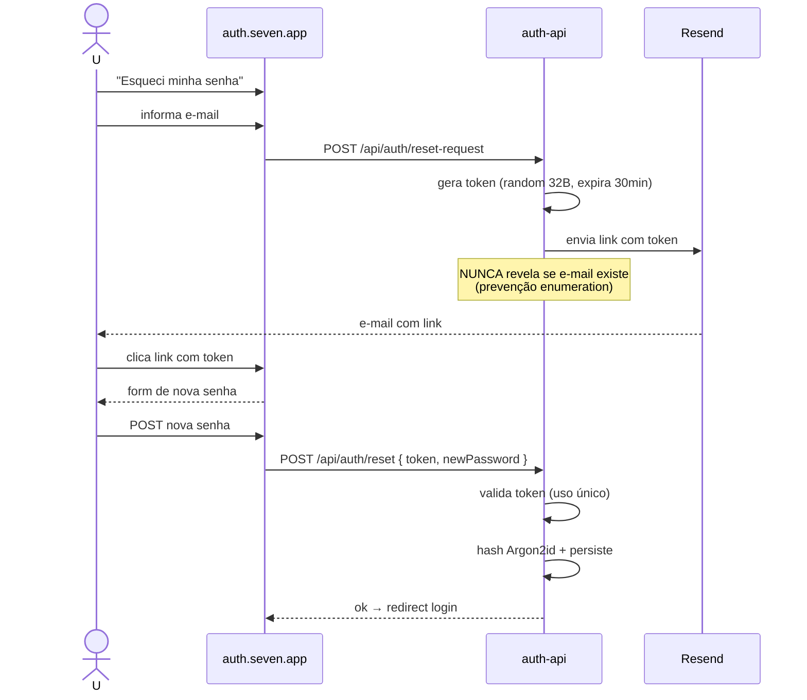

# Autenticação e Sessão

## Modelo

- **Login** centralizado em `auth.seven.app`.
- **Sessão** = cookie httpOnly assinado, com `Domain=.seven.app` para funcionar em todos os subdomínios.
- **Conteúdo do cookie**: `session_id` opaco. Dados (`user_id`, `tenant_id`, permissões cacheadas) ficam em Redis com TTL.
- **Tempo de vida**: idle 30min, absoluto 12h, refresh sliding com cada request.

## Fluxo

```mermaid
sequenceDiagram
    actor U as Usuário
    participant Auth as auth.seven.app
    participant API as auth-api
    participant Redis as Redis
    participant App as <modulo>.seven.app

    U->>Auth: GET /login
    Auth-->>U: form
    U->>Auth: POST { email, password }
    Auth->>API: POST /api/auth/login
    API->>API: Argon2id verify
    API->>Redis: SET session:<id> { user_id, tenant_id, perms }
    API-->>Auth: 200 + Set-Cookie session=<id>;<br/>Domain=.seven.app; HttpOnly; Secure; SameSite=Lax
    Auth-->>U: 302 → admin.seven.app

    U->>App: GET /dashboard (cookie viaja)
    App->>API: chamada via gateway
    API->>Redis: GET session:<id>
    Redis-->>API: { user_id, tenant_id, perms }
    API->>API: validar perm da rota
    API-->>App: 200 + dados
```

## Reset de senha



## Senhas

- Hash: **Argon2id** (`memory=64MB, iterations=3, parallelism=4`).
- Política: mínimo 8 chars, mistura de letras + números + símbolos.
- Histórico: últimas 5 senhas não podem ser reusadas.
- Bloqueio: 5 tentativas erradas consecutivas → bloqueio 15min.

## SSO (futuro)

- OIDC genérico para Google Workspace e Microsoft Entra.
- Mapping: `email` do IdP → busca por `(tenant_id, email)`.
- Provisionamento JIT desabilitado por default — admin pré-cria os usuários.

## CSRF

- API só aceita requests com `Origin` ou `Referer` válido (`*.seven.app`).
- Token CSRF adicional para forms tradicionais (se houver).
- Cookie `SameSite=Lax` cobre maior parte dos casos.

## Rate limit

- `/api/auth/login`: 5 tentativas / 5min por IP + por e-mail.
- `/api/auth/reset-request`: 3 / 30min por e-mail.

## Logout

- DELETE em `session:<id>` no Redis.
- `Set-Cookie session=; Max-Age=0; Domain=.seven.app`.
- Redirect → `auth.seven.app/login`.

## Logout em todos os dispositivos

- Endpoint `POST /api/auth/sessions/revoke-all` deleta todas as sessões do user.

## Auditoria

Eventos de auth gravados no audit log:
- `auth.login.success`
- `auth.login.failed`
- `auth.password.reset_requested`
- `auth.password.reset_completed`
- `auth.password.changed`
- `auth.session.revoked`
