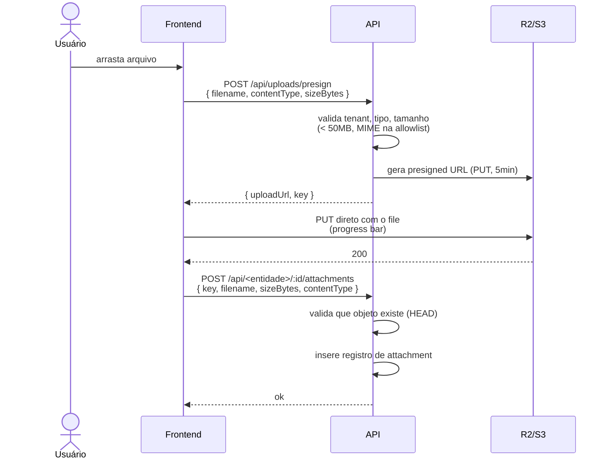

# Armazenamento de Arquivos

## Stack

- **S3** (AWS) ou **R2** (Cloudflare) — preferimos R2 por custo de egress zero.
- Buckets separados por ambiente: `seven-sgq-prod`, `seven-sgq-staging`, `seven-sgq-dev`.
- **Versionamento ativado** no bucket — recuperação de arquivos sobrescritos.
- **Server-side encryption** (SSE-S3 ou SSE-R2).

## Padrão de chaves

```
<tenant_id>/<modulo>/<entidade>/<entity_id>/<revision_id>/<filename>
```

Exemplos:
- `seven/docs/document/abc-123/rev-456/POP0001-rev01.pdf`
- `seven/nc/occurrence/xyz-789/foto-vazamento.jpg`
- `seven/opp/opportunity/.../proposta.pdf`

## Upload



## Download

Sempre via presigned URL (5min TTL). Nunca expor URL pública direta — todo acesso passa pela API.

```ts
// API
const url = s3.getSignedUrl('getObject', {
  Bucket: 'seven-sgq-prod',
  Key: attachment.storageKey,
  Expires: 300,
  ResponseContentDisposition: `inline; filename="${attachment.filename}"`,
});
return { url };
```

## Limites

| Item | Limite |
|---|---|
| Tamanho máximo por arquivo | 50 MB (default), 200 MB para PDFs publicados |
| Tipos permitidos | PDF, JPG, PNG, DOCX, XLSX, DWG (configurável por tenant) |
| Tipos bloqueados | EXE, JS, HTML, ZIP (anti-malware) |
| Quota por tenant (MVP) | 50 GB |

## Antivírus

- ClamAV em sidecar para escanear arquivos antes de marcar como "publicado".
- Status do arquivo: `pending_scan → clean | infected`.
- Arquivo infectado: bloqueado, registrado no audit log, admin notificado.

## Retenção

- Não deletamos por default.
- Documentos em status "Inativo" mantêm arquivos (auditoria).
- Soft delete da entidade preserva os attachments.
- Hard delete (raro, GDPR/LGPD) limpa via job dedicado.

## Backup

- Versionamento do bucket cobre sobrescrita.
- Replicação cross-region opcional (R2 multi-region).
- Restore drill: trimestral.

## Visualização inline

- **PDF**: PDF.js renderiza no navegador. Não força download.
- **Imagens**: thumbnail no listing, lightbox para preview.
- **Outros**: força download via `Content-Disposition: attachment`.

## URLs públicas (compartilhamento)

Para o botão "Compartilhar" do detalhe do documento:
- Gera `share_token` (UUID) com expiração configurável.
- URL: `docs.seven.app/share/<share_token>` mostra apenas o documento, sem login (somente leitura, com watermark do tenant).
- Auditável: cada acesso grava `audit_log` com IP.
- Revogável a qualquer momento.
