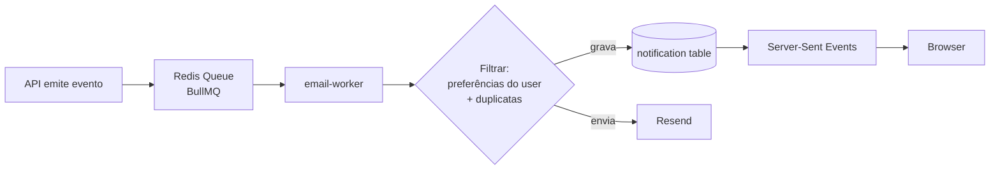

# Notificações

## Canais

| Canal | Quando | Tecnologia |
|---|---|---|
| **In-app** (badge no sino) | Toda notificação | DB + WebSocket / SSE / polling |
| **E-mail** | Eventos críticos + opt-in do usuário | Resend / SES |
| **Push browser** (futuro) | Eventos críticos | Web Push API |

## Modelo

```sql
CREATE TABLE notification (
  id UUID PRIMARY KEY,
  tenant_id UUID NOT NULL,
  user_id UUID NOT NULL,
  module TEXT NOT NULL,           -- 'docs', 'nc', 'opp', 'risk'
  type TEXT NOT NULL,             -- 'task_assigned', 'due_soon', etc
  title TEXT NOT NULL,
  body TEXT,
  link_path TEXT,                 -- caminho para abrir ao clicar
  read_at TIMESTAMPTZ,
  email_sent_at TIMESTAMPTZ,
  metadata JSONB,
  created_at TIMESTAMPTZ DEFAULT NOW()
);
```

## Fluxo



## Tipos de notificação por módulo

### Documentos
- `docs.task.elaboration_assigned` — você é elaborador
- `docs.task.approval_assigned` — você é aprovador
- `docs.read_required` — leitura obrigatória atribuída
- `docs.expiring_soon` — validade < 30d (responsável)
- `docs.expired` — validade vencida

### Não Conformidades
- `nc.occurrence.notified` — incluído na lista de notificados
- `nc.immediate_action.assigned` — AI atribuída
- `nc.rnc.escalated` — sua ocorrência virou RNC
- `nc.rnc.plan_approval_pending` — aprovador
- `nc.corrective_action.due_soon` — prazo < 3d
- `nc.effectiveness.due` — verificador

### Oportunidades
- `opp.validation_pending` — validador
- `opp.action_due_soon` — responsável
- `opp.closed` — solicitante

### Riscos
- `risk.identified` — responsável da unidade
- `risk.treatment.due_soon` — responsável
- `risk.reassessment.due` — responsável
- `risk.upgraded_quadrant` — risco piorou

## Preferências do usuário

Cada user pode escolher por canal e por módulo. Default: tudo ativado.

```ts
type NotificationPreferences = {
  email: {
    docs: boolean;
    nc: boolean;
    opp: boolean;
    risk: boolean;
    digest: 'never' | 'daily' | 'weekly'; // resumo
  };
  in_app: {
    /* mesmos campos */
  };
};
```

## Templates de e-mail

- Stack: **React Email** + **Resend**.
- Templates compartilhados em `packages/notifications/templates/`.
- Sempre incluir: logo, título, corpo, **CTA único** com link absoluto, footer com link de preferências e política de privacidade.

## Anti-spam

- Rate limit: máx 5 e-mails / 5min por user para o mesmo tipo.
- Digest opcional: agrupa N notificações em 1 e-mail se user escolher "diário" ou "semanal".
- Unsubscribe link em todo e-mail (LGPD).

## Real-time in-app

- Server-Sent Events (`/api/notifications/stream`) para updates do badge.
- Fallback para polling de 30s se navegador não suportar.

## Audit

Toda notificação enviada por e-mail grava `email_sent_at` na tabela e log `notification.email_sent` no audit (sem corpo do e-mail, só ID).
