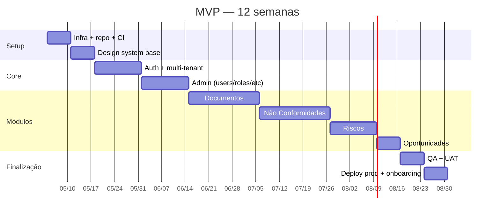

# Roadmap — MVP

## Objetivo do MVP

Entregar SGQ funcional para Seven Resíduos com **5 módulos** suficientes para passar uma auditoria interna e operar dia-a-dia da gestão ambiental.

## Escopo do MVP

### Módulos
1. ✅ **Administrador** (espinha dorsal)
2. ✅ **Documentos** (procedimentos + licenças com validade)
3. ✅ **Não Conformidades** (ocorrências + RNCs com fluxo completo)
4. ✅ **Riscos** (matriz por unidade)
5. ✅ **Oportunidades** (matriz P × I)

### Cross-cutting
- ✅ Auth com cookie cross-subdomain
- ✅ Audit log
- ✅ Notificações in-app + e-mail (sem digest)
- ✅ Storage com presigned URLs
- ✅ i18n pt-BR

### Não-MVP (fora)
- Mobile nativo
- Indicadores / KPIs configuráveis
- Auditorias internas
- Calibrações
- Fornecedores
- MTR / Manifestos
- Inventário de resíduos
- SSO
- White-label

## Cronograma sugerido (12 semanas)

Total: **~16 semanas** com 1 dev full-stack ou **~10 semanas** com 2 devs (front + back).

## Critérios de "pronto"

- [ ] Login funciona em todos os subdomínios
- [ ] Admin permite criar usuário, grupo, processo, unidade
- [ ] Audit log registra ações de todos os módulos
- [ ] Documentos: cadastrar interno → publicar → revisar → vencer → notificar
- [ ] NC: registrar ocorrência → escalar → tratar 6 etapas → encerrar
- [ ] Riscos: configurar unidade → identificar → tratar → reavaliar
- [ ] Oportunidades: configurar matriz → cadastrar → priorizar → implementar
- [ ] Backup automático rodando
- [ ] Sentry capturando erros
- [ ] PostHog rastreando usage básico
- [ ] Documentação atualizada (este repo)
- [ ] Runbook de incident response em `06-roadmap/runbook.md` (criar)

## KPIs de sucesso (90 dias pós-launch)

| KPI | Meta |
|---|---|
| Uptime | > 99.5% |
| Tempo médio para resolver bug crítico | < 24h |
| % de usuários ativos semanais | > 80% do total |
| Documentos publicados | > 50 |
| RNCs encerradas com eficácia | > 80% |
| Riscos identificados | > 30 |
| NPS interno (Seven) | > 50 |

## Próxima fase

Ver [`phase-2.md`](phase-2.md).
