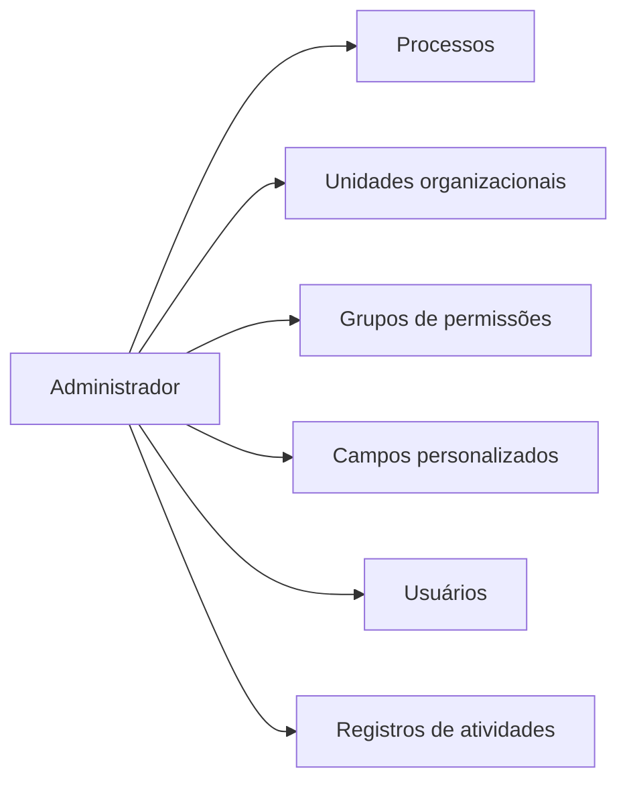

# Administrador — visão geral

É o **módulo de configuração** do sistema. Define **quem** usa, **onde** (unidades), **em que área** (processos) e com **que permissões**.

## Quando você precisa entrar aqui

| Necessidade | Tela |
|---|---|
| Adicionar / remover pessoa que vai usar o sistema | [Usuários](usuarios.md) |
| Definir o que cada pessoa pode fazer | [Grupos de permissões](grupos-permissoes.md) |
| Cadastrar uma filial / fábrica nova | [Unidades organizacionais](unidades.md) |
| Cadastrar uma área da empresa (Produção, Vendas, etc.) | [Processos](processos.md) |
| Adicionar um campo extra que não existe num cadastro | [Campos personalizados](campos-personalizados.md) |
| Investigar quem fez o quê e quando | [Registros de atividades](audit-log.md) |

## Quem acessa

Apenas usuários cujo grupo de permissões tem ao menos uma permissão de Administrador (`admin.*`). Geralmente: **Admin do tenant** e **Coord. Qualidade**.

Se você não vê o módulo "Administrador" no seletor de módulos, é porque seu grupo não tem nenhuma permissão dele.

## Estrutura

A barra superior tem essas 5 abas + o atalho Registros de atividades aparece pela engrenagem ⚙.

## Ordem de configuração inicial (recomendada)

Ao implantar pela primeira vez:

1. **Cadastrar Processos** (suas áreas funcionais).
2. **Cadastrar Unidades** (Matriz, filiais, fábricas).
3. **Criar Grupos de permissões** customizados (Admin já vem; criar Coord, Auditor, Operacional).
4. **Cadastrar Usuários** já atribuindo a um grupo correto.
5. **Configurar Campos personalizados** para cada módulo, conforme necessidade.
6. Só **depois** começar a usar Documentos / NC / Riscos / Oportunidades.

Se inverter a ordem, vai ter que voltar depois para corrigir vínculos.
