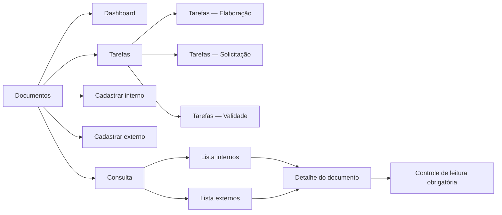
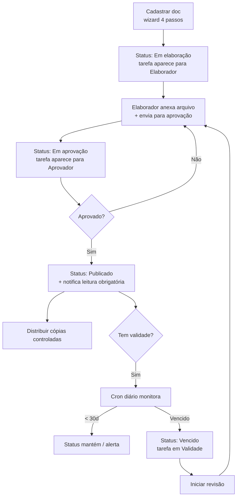
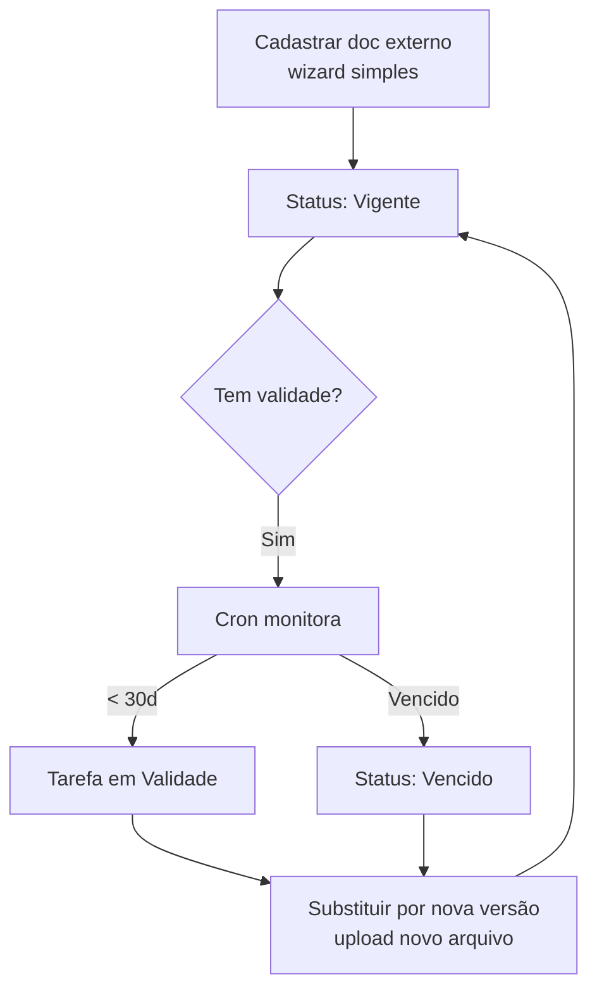

# Documentos — visão geral

Onde você gerencia **todos os documentos do sistema**: procedimentos internos (POPs, políticas, manuais), licenças, certificados, normas externas. Controla validade, versão, leitura obrigatória e cópia controlada.

## URL do módulo

`documents.qualyteam.com`

## Top-bar interno do módulo

```
[Logo] [Documentos ▾] [Dashboard] [Tarefas] [Documento interno] [Documento externo] [Consulta ▾]
```

| Aba | O que tem ali |
|---|---|
| **Dashboard** | Visão executiva: gráficos por status, unidade, processo, vencimento |
| **Tarefas** | Suas pendências: documentos que você precisa elaborar, aprovar, ou que estão vencendo sob sua responsabilidade |
| **Documento interno** | Botão direto para cadastrar **documento interno novo** |
| **Documento externo** | Botão direto para cadastrar **documento externo novo** |
| **Consulta ▾** | Lista mestra: dropdown com 2 opções — "Documentos internos" e "Documentos externos" |

## O que é "Documento interno" vs "Documento externo"

| | Documento interno | Documento externo |
|---|---|---|
| **Quem cria o conteúdo** | Sua empresa | Vem de fora (órgão, fornecedor, cliente) |
| **Tem ciclo de elaboração / aprovação interna?** | ✅ Sim — wizard com Elaborador + Aprovador | ❌ Não — só catalogamos / controlamos |
| **Exemplos** | POP, Política, Manual, Instrução de trabalho, Procedimento | Licença ambiental, Certificado, Norma ISO, Lei, Contrato |
| **Tem revisão numerada?** | ✅ Sim (00, 01, 02…) | Pode ter (data nova) mas é mais simples |
| **Tem leitura obrigatória?** | ✅ Sim | Geralmente não (o usuário só consulta) |
| **Tem cópia controlada?** | ✅ Sim | Não |
| **Tem validade?** | Opcional | ✅ Quase sempre (licença vence) |

## Mapa das telas



## Fluxo típico (interno)



## Fluxo típico (externo)



## Estados possíveis de um documento

| Status | Significado |
|---|---|
| **Rascunho** | Cadastrado mas ainda sem arquivo / sem fluxo iniciado |
| **Em elaboração** | Elaborador está produzindo / anexando |
| **Em aprovação** | Aguardando aprovação |
| **Publicado** | Vigente, disponível para leitura |
| **Em revisão** | Tem revisão nova em andamento (publicado ainda visível) |
| **Vencido** | Validade passou (continua visível, com badge vermelho) |
| **Inativo** | Manualmente inativado (substituído / obsoleto) |

## Permissões deste módulo

| Permissão | Para quê |
|---|---|
| `docs.internal.create` | Cadastrar doc interno |
| `docs.external.create` | Cadastrar doc externo |
| `docs.read` | Ver Consulta (lista mestra) |
| `docs.update` | Editar dados cadastrais |
| `docs.delete` | Excluir documentos |
| `docs.export` | Exportar lista para CSV/Excel |
| `docs.tasks.read_all` | Ver tarefas atribuídas a outros (não só as suas) |
| `docs.dashboard.read` | Ver Dashboard |
| `docs.published_file.replace` | Trocar arquivo de doc já publicado |
| `docs.controlled_copy.delete` | Revogar cópia controlada distribuída |
| `docs.read_required.manage` | Definir lista de leitura obrigatória |
| `docs.audit.read` | Ver registros de atividades do módulo |
