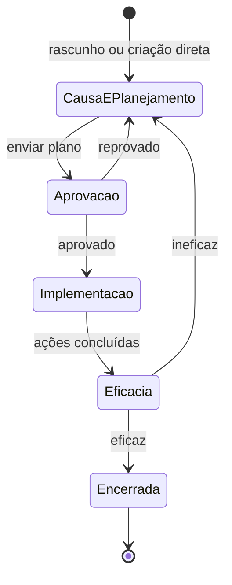

# Não Conformidades — Registrar não conformidade (RNC)

## Onde fica

`Não conformidades → Registrar não conformidade` (URL: `/nonconformance-reports/new`)

> Ou: a partir de uma **Ocorrência aberta**, botão **"Escalar para RNC"** no detalhe.

## Quem acessa

`nc.rnc.create`. Geralmente: Coord. Qualidade (não operacional comum).

## Quando usar

Para **tratamento formal** de não conformidade. Mais demorado e completo que ocorrência. Exigido por norma quando:

- Houve **impacto real** (ambiental, financeiro, segurança).
- Cliente exige análise formal (com 8D, A3 ou similar).
- Auditoria identificou e exige tratamento documentado.
- Evento recorrente (mesmo problema repetido).
- Requisito ISO 9001:2015 / 14001 cláusula 10.2 (Não conformidade e ação corretiva).

> Para eventos pequenos / contornáveis: use **Registrar ocorrência** em vez disso.

## O wizard (4 passos típicos)

```
            ┌── 1. Descrição ──┬── 2. Causa ──┬── 3. Plano de ação ──┬── 4. Verificação ──┐
```

### Passo 1: Descrição

```
Registrar não conformidade
[1] Descrição ●  [2] Causa  [3] Plano  [4] Verificação

Vincular a ocorrência existente?
☐ Sim, esta RNC vem de uma ocorrência:
   [ Selecionar ocorrência                                              ▾]

Descrição da não conformidade *
[ ............................................................................ ]
                                                                         0/3000

Data da identificação *
[ DD/MM/AA ]

Unidades organizacionais *
[ Selecione                                                                   ▾]

Processos *
[ Selecione                                                                   ▾]

Origem *
[ Selecione                                                                   ▾]

Tipo de NC *  ⓘ
⊙ Real (ocorreu impacto)
⊙ Potencial (risco identificado, ainda não ocorreu)

Severidade *
⊙ Baixa  ⊙ Moderada  ⊙ Alta  ⊙ Crítica

Cliente afetado / parte interessada
[ ........................................................... ]

Inserir anexos (evidências, fotos, e-mails, contratos)
[ + Inserir anexos ]

[ Próximo ]
```

#### Campos do passo 1

| Campo | O que é |
|---|---|
| **Vincular a ocorrência** | Se a RNC vem de uma ocorrência prévia, selecione. Senão, pula |
| **Descrição** | Texto detalhado, factual, sem opinião |
| **Data de identificação** | Quando foi identificada (não quando aconteceu o evento) |
| **Unidades / Processos / Origem** | Mesmos do cadastro de ocorrência |
| **Tipo** | Real (já causou) ou Potencial (poderia causar) |
| **Severidade** | Baixa / Moderada / Alta / Crítica |
| **Cliente afetado** | Se há parte externa afetada |
| **Anexos** | Evidências obrigatórias para auditoria |

### Passo 2: Análise de causa

```
[2] Análise de causa ●

Método de análise *
⊙ 5 Porquês
⊙ Diagrama de Ishikawa
⊙ A3 / outro

```

#### Se escolher 5 Porquês

```
Por que isso aconteceu? *
[ Bombona estava trincada                                                     ]

Por que estava trincada?
[ Material da bombona não suporta resíduo Classe I                            ]

Por que o material era inadequado?
[ Procedimento de compras não validava classe do resíduo                       ]

Por que não validava?
[ Procedimento foi escrito antes de operarmos Classe I                         ]

Por que não foi atualizado?
[ Não temos checklist de revisão periódica de procedimentos                    ]

Causa raiz identificada *
[ Falta de processo de revisão periódica de procedimentos quando muda escopo  ]
```

#### Se escolher Ishikawa

Aparece grade com 6 categorias clássicas:

```
                            Problema central
                                  ↑
   ┌────────────┬────────────┬────────────┐
   │ Método     │ Máquina    │ Mão de obra│
   │ • ......   │ • ......   │ • ......   │
   │ • ......   │            │            │
   ├────────────┼────────────┼────────────┤
   │ Material   │ Medida     │ Meio amb.  │
   │ • ......   │ • ......   │ • ......   │
   └────────────┴────────────┴────────────┘

Causa raiz consolidada *
[ ............................................................................ ]
```

Você adiciona pontos em cada categoria, depois consolida.

#### Anexar evidências da análise
```
[ + Anexar análise (planilha, mapa mental, gravação de reunião) ]
```

### Passo 3: Plano de ação

```
[3] Plano de ação ●

Ações corretivas (eliminar a causa raiz)

[ + Adicionar ação corretiva ]

AC 1
   Descrição: [ Implementar procedimento de revisão semestral de POPs operacionais quando ─]
              [ houver mudança de escopo ]
   Responsável: [ Beatriz Brito                                              ▾]
   Prazo: [ 30/06/2026 ]
   Recursos / custo estimado: [ ........... ]

AC 2
   Descrição: [ Treinar coordenadores em revisão de procedimentos                          ]
   Responsável: [ RH (Maria Souza)                                            ▾]
   Prazo: [ 15/07/2026 ]

[ + Adicionar ]

Aprovador do plano *
[ Diretor Operacional - João Diretor                                          ▾]

[ Voltar ]   [ Próximo ]
```

#### Cada AC

| Campo | O que é |
|---|---|
| Descrição | O que executar |
| Responsável | Quem executa |
| Prazo | Data limite |
| Recursos / custo | Opcional, ajuda na aprovação |

### Passo 4: Verificação de eficácia

```
[4] Verificação ●

Como vai medir eficácia?
[ ............................................................................ ]
[ Ex: "Acompanhar pelas próximas 8 semanas se há nova ocorrência similar.       ]
[      Esperar 0 ocorrências da mesma causa." ]

Data prevista da verificação *
[ DD/MM/AA ]      ← geralmente 60-90 dias após última AC concluída

Verificador *
[ Selecione                                                                   ▾]

Critério de eficácia
☑ Sem nova ocorrência da mesma causa raiz no período
☐ Indicador X melhorou em Y%
☐ Auditoria de follow-up confirmou implementação
☐ Outro: [ ........... ]

[ Voltar ]   [ Gravar e enviar para aprovação ]
```

## Botão "Gravar e enviar para aprovação"

1. Cria a RNC com **status "Aprovação"** (ou "Causa e Planejamento" se você não quer enviar ainda — botão extra "Salvar rascunho").
2. Toast verde: "RNC-018 criada. Plano enviado para aprovação."
3. Redireciona para detalhe da RNC.
4. **Notifica o aprovador** designado: e-mail + in-app.
5. RNC aparece na aba **Tarefas → Aprovação** do aprovador.

## Onde a RNC vai aparecer depois

- **Tarefas → cada aba conforme avança**: Aprovação → Implementação → Eficácia → (Encerrada).
- **Consulta → Não conformidades**.
- **Dashboard → widgets de RNC**.
- Se eficaz, entra no widget de **Eficácia**.

## Estados pós-criação



## Notificações por etapa

| Quando | Quem |
|---|---|
| RNC criada e plano enviado | Aprovador |
| Plano aprovado | Responsáveis das ACs |
| AC com prazo < 3 dias | Responsável |
| AC concluída | Coord. Qualidade (criador) |
| Última AC concluída | Verificador (já avisando que vai precisar verificar em N dias) |
| Hora de verificar (data prevista) | Verificador |
| Verificação feita (eficaz/ineficaz) | Coord. Qualidade + envolvidos |

## Permissões

| Ação | Permissão |
|---|---|
| Cadastrar RNC direto | `nc.rnc.create` |
| Escalar de ocorrência | `nc.rnc.create` + ser responsável da ocorrência |
| Editar enquanto aberta | `nc.rnc.update_open` ou ser responsável |
| Excluir RNC | `nc.rnc.delete` (raríssimo de liberar) |

## Estados especiais

### Vincular ocorrência já vinculada
Bloqueado: "Esta ocorrência já foi escalada para outra RNC".

### Plano sem ações corretivas
Bloqueado no passo 3: "Pelo menos uma ação corretiva é obrigatória".

### Aprovador = Responsável de uma AC
Aviso: "O aprovador também é responsável de uma ação. Ok?". Permitido mas não recomendado (conflito de interesse).

## Exemplo Seven — RNC completa

**Origem**: várias ocorrências repetidas de vazamento de bombonas (5 em 2 meses).

**Passo 1**:
- Vincular a ocorrência: OC-038, OC-040, OC-042, OC-045, OC-047 (multi-link)
- Descrição: "Recorrência de vazamento em bombonas Classe IIA, lote 2025-12 da fornecedora ABC. 5 eventos em 60 dias com perda total de ~12L de resíduo no compartimento de transporte."
- Data: 30/04/2026
- Unidades: CT Caieiras, Base Norte
- Processos: Operações
- Origem: Inspeção
- Tipo: Real
- Severidade: Alta
- Cliente afetado: nenhum (interno)
- Anexos: relatório de não conformidade do lote, fotos, e-mail do controle de qualidade

**Passo 2 (5 Porquês)**:
1. Por que vazamento? → Bombonas com fissuras na solda.
2. Por que fissuras? → Material com defeito de fabricação.
3. Por que recebemos material defeituoso? → Inspeção de recebimento não testa solda.
4. Por que não testa? → Critério não está no procedimento de recebimento.
5. Por que? → Procedimento foi escrito sem considerar bombonas Classe II.

**Causa raiz**: Procedimento de recebimento incompleto para bombonas Classe II.

**Passo 3 (Plano)**:
- AC-1: Atualizar procedimento de recebimento incluindo teste de solda (Pedro Almoxarifado, 15/05/2026)
- AC-2: Treinar equipe de recebimento (RH, 30/05/2026)
- AC-3: Reclamar fornecedora ABC formalmente, exigir nova remessa testada (Compras, 10/05/2026)
- AC-4: Inspecionar todo o estoque atual da fornecedora ABC (Pedro, 12/05/2026)
- Aprovador: Diretor Operacional

**Passo 4 (Verificação)**:
- Como medir: 0 vazamentos do lote da ABC nos próximos 90 dias.
- Data prevista: 30/08/2026
- Verificador: Beatriz Brito
- Critério: ☑ Sem nova ocorrência da mesma causa

**Gravar**: RNC-018 criada, vai para Aprovação. Diretor recebe e-mail. Aprova em 2 dias. AC-1 a AC-4 são distribuídas. Em 30 dias todas concluídas. Em 30/08/2026 verificação: 0 ocorrências, **Eficaz**. RNC-018 encerrada com sucesso.
