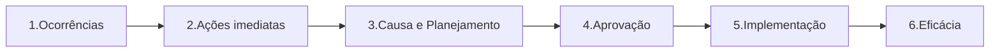

# Não Conformidades — Tarefas (6 abas)

## Onde fica

`Não conformidades → Tarefas` (URL: `/tasks/<aba>`)

## Quem acessa

Default: você. Para ver de outros, `nc.tasks.read_all`.

## ⭐ As 6 abas correspondem às 6 etapas do fluxo

```
┌─Ocorrências─┬─Ações imediatas─┬─Causa e planejamento─┬─Aprovação─┬─Implementação─┬─Eficácia─┐
```

Cada aba mostra **o que está naquela etapa do fluxo** e que é responsabilidade sua.



---

## Aba 1: Ocorrências

URL: `/tasks/occurrences`

### O que aparece
Ocorrências que estão **abertas** e onde você é responsável.

```
┌──────────────────────────────────────────────────────────────────────┐
│ # │ Código │ Descrição          │ Unidade   │ Origem    │ Data       │
│ 1 │ OC-042 │ Vazamento no...    │ Caieiras  │ Inspeção  │ 28/04/2026 │
│ 2 │ OC-040 │ Atraso entrega...  │ Matriz    │ Reclam.   │ 25/04/2026 │
└──────────────────────────────────────────────────────────────────────┘
```

### Como cai aqui
- Alguém registrou ocorrência em `Registrar ocorrência` te marcando como responsável (ou seu setor).
- Sistema também coloca aqui ocorrências que você criou e ainda não encerrou.

### Ações
- Clicar abre detalhe da ocorrência.
- Lá você pode: **Encerrar**, **Criar ações imediatas**, **Escalar para RNC**.

### Notificações
- Recebe e-mail quando vira responsável.
- Recebe lembrete se ocorrência fica > 7 dias sem ação.

---

## Aba 2: Ações imediatas

URL: `/tasks/immediate-actions`

### O que aparece
**Ações imediatas (AI)** atribuídas a você, pendentes de execução.

AI = ação **rápida de contenção**. Antes mesmo de saber a causa raiz, você faz algo para parar o sangramento.

Exemplos:
- "Conter o derramamento com material absorvente" (em 1h).
- "Substituir bombona danificada" (hoje).
- "Notificar cliente sobre atraso" (em 24h).

### Como cai aqui
Quando alguém registra uma ocorrência (passo 2 do wizard) ou uma RNC, define ações imediatas com responsável + prazo. A pessoa designada vê na aba.

### Cada coluna
| Coluna | O que mostra |
|---|---|
| Vinculado a | Ocorrência ou RNC pai (clicável) |
| Descrição | O que precisa ser feito |
| Prazo | Data limite. Vermelho se atrasado |
| Status | Pendente / Em execução / Concluída |

### Ações
- Clicar abre detalhe da AI.
- Marcar **"Concluída"** com evidência (anexar foto, descrever o que foi feito).
- Sistema notifica o registrador da ocorrência.

---

## Aba 3: Causa e planejamento

URL: `/tasks/cause-planning`

### O que aparece
RNCs onde **você é responsável** pela análise de causa raiz e elaboração do plano de ação corretiva.

### Como cai aqui
- Uma ocorrência foi escalada para RNC e te designou.
- Ou você registrou uma RNC direto e se atribuiu.
- Ou um plano foi reprovado pela aprovação e voltou para refinar.

### Ações
- Clicar abre detalhe da RNC.
- Preencher: **método de análise** (5 Porquês ou Ishikawa) + **plano de ações** (cada uma com responsável + prazo).
- Quando pronto: clicar **"Enviar para aprovação"**.
- RNC sai daqui, vai para a aba **Aprovação** do aprovador.

### Métodos de análise

#### 5 Porquês
```
Por que o derramamento aconteceu? → Bombona estava trincada.
Por que estava trincada? → Material não era adequado para resíduo Classe I.
Por que não era adequado? → Especificação de compra estava errada.
Por que estava errada? → Procedimento de compras não validava esse parâmetro.
Por que não validava? → Procedimento não previa Classe I.
```
Resultado: **Causa raiz** = procedimento de compras incompleto. Solução: revisar procedimento.

#### Ishikawa (espinha de peixe)
Categorias clássicas: **Método, Máquina, Mão-de-obra, Material, Medida, Meio Ambiente**. Cada categoria contribui com causas. Você vai listando.

---

## Aba 4: Aprovação

URL: `/tasks/approval`

### O que aparece
RNCs com **plano de ação esperando sua aprovação**. Você é o aprovador designado (geralmente gerência).

### Como cai aqui
Alguém na etapa anterior clicou "Enviar para aprovação" te marcando.

### Ações
- Clicar abre detalhe da RNC.
- Lê: análise de causa + plano proposto.
- Decide: **Aprovar** ou **Reprovar com comentários**.
- Se aprovar: RNC vai para **Implementação**, responsáveis das ações são notificados.
- Se reprovar: volta para **Causa e planejamento** com seus comentários.

### Critérios típicos para aprovar
- Causa raiz faz sentido (não ficou em "fulano errou").
- Ações atacam a causa, não só o sintoma.
- Prazos realistas.
- Responsáveis fazem sentido.
- Custo / benefício razoável.

---

## Aba 5: Implementação

URL: `/tasks/implementation`

### O que aparece
**Ações corretivas (AC)** atribuídas a você — coisas que você precisa **executar**.

### Diferença para Ações Imediatas
| AI | AC |
|---|---|
| Contenção rápida (horas/dias) | Eliminar causa raiz (dias/semanas/meses) |
| Não exige análise prévia | Exige análise de causa concluída + plano aprovado |
| Não impede recorrência | Impede recorrência |

Exemplo: AI "tampar buraco da estrada" / AC "rever processo de manutenção das estradas".

### Cada coluna
| Coluna | O que mostra |
|---|---|
| Vinculado a | RNC pai |
| Descrição | O que executar |
| Prazo | Data limite |
| Progresso | % ou marco atual |

### Ações
- Clicar → marcar como **"Concluída"** com evidência.
- Anexar fotos, documentos, links de comprovação.
- Quando todas as ACs da RNC são concluídas, RNC vai para **Eficácia**.

---

## Aba 6: Eficácia

URL: `/tasks/effectiveness`

### O que aparece
RNCs onde **você é o verificador** designado para checar se as ações corretivas foram eficazes.

### Como cai aqui
- Todas as ACs foram concluídas.
- Após o **prazo de eficácia** (default 60-90 dias depois das ACs), sistema move a RNC para esta aba.

### O que verificar
- A causa raiz **não voltou a ocorrer** no período observado?
- Houve indicador específico que melhorou?
- Auditoria de follow-up confirma?

### Ações
- Clicar → registrar verificação.
- Marcar **Eficaz** ou **Ineficaz** com evidência (texto + anexo).
- **Eficaz** → RNC vira "Encerrada com eficácia". 🎉
- **Ineficaz** → RNC volta para **Causa e planejamento** para replanejar. Sistema anota que houve 1 ciclo.

### Múltiplos ciclos de ineficácia
- Após 3 ciclos ineficazes, sistema flagra: "Esta RNC tem causa estrutural. Considerar revisão de processo."

---

## Filtros comuns a todas as abas

| Filtro | O que filtra |
|---|---|
| Responsável | Default = você. `nc.tasks.read_all` para ver de outros |
| Unidade organizacional | Da unidade |
| Processo | Do processo |
| Origem | Auditoria / Reclamação / Inspeção / etc. |
| Prazo | Atrasado / Vencendo / OK |
| Período | Faixa de datas |

## Notificações em todas as abas

| Quando | Quem | Canal |
|---|---|---|
| Tarefa atribuída a você | Você | E-mail + in-app |
| Prazo se aproximando (< 3 dias) | Você | E-mail |
| Prazo estourou | Você + chefe | E-mail |
| Tarefa reatribuída para você | Você | E-mail + in-app |

## Estados especiais

### Aba vazia
"Nenhuma tarefa pendente nesta etapa". Significa: você não tem nada para fazer aqui agora.

### Tarefa atrasada
Linha aparece com **borda vermelha**. Coluna "Prazo" mostra dias de atraso.

### Sem permissão para a aba
Aba não aparece. Se você não tem permissão de aprovar (ex: não é gerência), a aba "Aprovação" some — não aparece como bloqueada.

## Permissões necessárias (por aba)

| Aba | Permissão típica |
|---|---|
| Ocorrências | (default) |
| Ações imediatas | Ser o responsável da AI |
| Causa e planejamento | `nc.rnc.update_open` ou ser responsável |
| Aprovação | Ser aprovador designado da RNC |
| Implementação | Ser responsável da AC |
| Eficácia | Ser verificador designado |

## Exemplo Seven — uma RNC andando pelas abas

**Dia 1**: Carlos (operacional) detecta vazamento de óleo no caminhão. Registra **Ocorrência OC-042**.

**Dia 1, mais tarde**: Beatriz (Coord. Qualidade) vê em sua aba Ocorrências. Decide escalar para RNC porque há risco ambiental real. Atribui **Ações imediatas**:
- AI 1: "Conter vazamento com material absorvente" — Carlos, prazo 4h.
- AI 2: "Coletar amostra do solo afetado" — Pedro, prazo 24h.

Carlos e Pedro veem em suas abas **Ações imediatas**. Concluem rapidamente.

**Dia 2**: RNC-018 criada. Beatriz é responsável pela análise. Vê em **Causa e planejamento**.
- Faz 5 Porquês: causa raiz = falta de manutenção preventiva nos caminhões.
- Plano: AC-1 "Implementar checklist diário de inspeção" (Mecânico chefe, 30 dias). AC-2 "Treinar motoristas em inspeção pré-rota" (RH, 45 dias).
- Envia para aprovação.

**Dia 3**: Diretor vê em **Aprovação**. Aprova.

**Dia 4-30**: Mecânico chefe vê AC-1 em **Implementação**. Implementa o checklist. Marca como concluída com fotos.

**Dia 4-45**: RH vê AC-2 em **Implementação**. Faz treinamento. Anexa lista de presença.

**Dia 75 (45 dias após últimas ações)**: RNC-018 vai para **Eficácia**. Beatriz é verificadora.
- Verifica: nenhum vazamento similar nos últimos 45 dias. ✅
- Marca como **Eficaz**.

**Dia 75**: RNC-018 encerrada. Aparece no widget "Eficácia" do Dashboard. Equipe é parabenizada na reunião.
