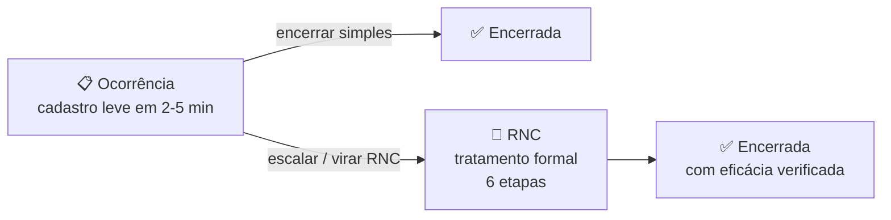
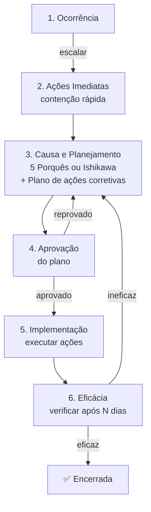
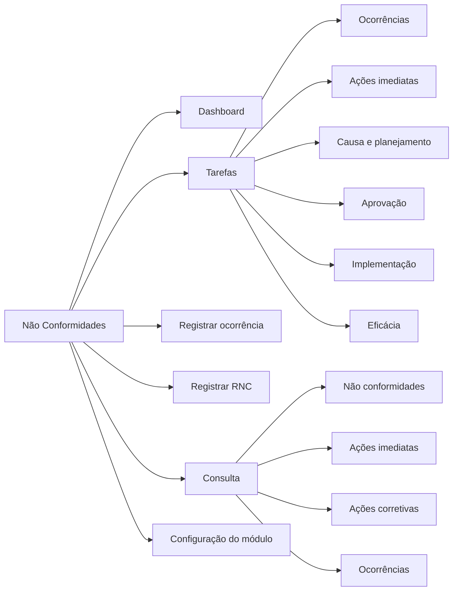

# Não Conformidades — visão geral

Onde você captura e trata **eventos não conformes** no SGQ/SGA: vazamentos, derramamentos, falhas operacionais, reclamações, desvios de processo, incidentes ambientais.

## URL do módulo

`nc.qualyteam.com` (ou `nonconformities.qualyteam.com`)

## Top-bar interno

```
[Logo] [Não conformidades ▾] [Dashboard] [Tarefas] [Registrar ocorrência] [Registrar não conformidade] [Consulta ▾]
```

| Aba | O que tem |
|---|---|
| **Dashboard** | Visão executiva: NCs/Ocorrências por status, unidade, processo, origem, eficácia |
| **Tarefas** | Suas pendências em **6 etapas do fluxo**: Ocorrências → Ações imediatas → Causa e planejamento → Aprovação → Implementação → Eficácia |
| **Registrar ocorrência** | Cadastrar uma **ocorrência leve** (registro inicial rápido) |
| **Registrar não conformidade** | Cadastrar diretamente uma **RNC** (tratamento formal completo) |
| **Consulta ▾** | Lista mestra com 4 visões: Não conformidades, Ações imediatas, Ações corretivas, Ocorrências |

## ⭐ Conceito-chave: Ocorrência ≠ RNC

**Ocorrência**: registro **leve** de um evento. Pode ou não escalar para RNC.
**RNC** (Relatório de Não Conformidade): **tratamento formal completo** com 6 etapas.



### Quando registrar Ocorrência (sem virar RNC)

- Evento pequeno, contornável no momento.
- Reclamação simples já resolvida.
- Quase-acidente sem impacto.
- "Para registro" de eventos do dia-a-dia.

### Quando virar RNC

- Requisito de norma exige tratamento formal (ISO 9001 / 14001).
- Houve impacto real (ambiental, financeiro, segurança).
- Repetição de evento (recorrente = ação corretiva sistêmica).
- Cliente exige análise formal.
- Auditoria identificou.

## Os 6 estados do fluxo de RNC



Cada etapa tem **uma aba dedicada de Tarefas**, mostrando o que está naquele estágio sob sua responsabilidade.

## Mapa das telas



## Permissões deste módulo

| Permissão | Para quê |
|---|---|
| `nc.occurrence.create` | Registrar ocorrência |
| `nc.occurrence.update_delete` | Editar/excluir ocorrência |
| `nc.occurrence.close` | Encerrar ocorrência |
| `nc.rnc.create` | Registrar RNC (direto ou escalar de ocorrência) |
| `nc.rnc.update_open` | Editar RNC enquanto está em fluxo |
| `nc.rnc.delete` | Excluir RNC (raríssimo) |
| `nc.rnc.read` | Ler RNCs (Consulta) |
| `nc.rnc.export` | Exportar lista |
| `nc.tasks.read_all` | Ver tarefas de outros |
| `nc.dashboard.read` | Ver Dashboard |
| `nc.config.update` | Editar configuração do módulo (origens, métodos) |
| `nc.origin.create` | Adicionar origem nova |
