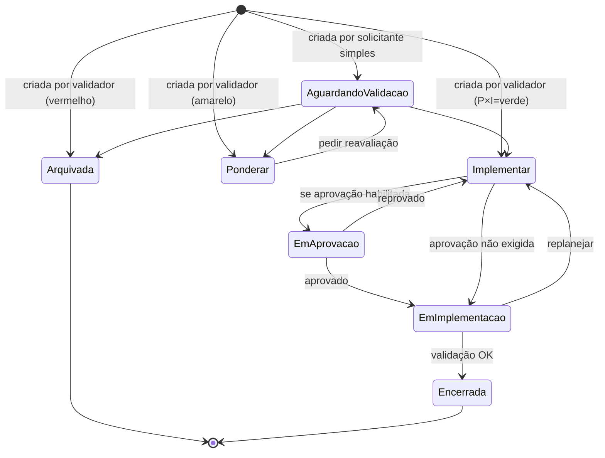

# Oportunidades — Nova oportunidade

## Onde fica

`Oportunidades → Nova oportunidade de melhoria` (URL: `/new`)

## Quem acessa

`opp.create`. Pode ser liberado para **todos os usuários** (cultura de melhoria contínua é mais forte com captação ampla).

## O wizard (2 passos)

### Passo 1: Identificação

```
Nova oportunidade de melhoria
[1] Identificação ●  [2] Avaliação inicial

Descrição da oportunidade *
[ Substituir bombonas plásticas Classe IIA por inox para resíduos com pH < 2,    ]
[ reduzindo trocas mensais e desperdício de embalagem.                            ]
                                                                          120/3000

Unidade organizacional *
[ Selecione                                                                    ▾]

Processo *
[ Selecione                                                                    ▾]

Solicitante
[ Beatriz Brito (você)                                                          ]

Categoria (opcional)
[ Redução de resíduo                                                          ▾]

Benefício esperado
[ Reduzir 80% de descarte de bombonas plásticas em uso para resíduos ácidos     ]

Custo estimado (R$)
[ 25.000                                                                        ]

Anexos
[ + Inserir anexos ]

[ Próximo ]
[ Cancelar ]
```

#### Cada campo

| Campo | O que é | Obrigatório? |
|---|---|---|
| Descrição | Texto explicando a ideia (max 3000) | ✅ |
| Unidade organizacional | Onde se aplica | ✅ |
| Processo | Em qual processo | ✅ |
| Solicitante | Quem propôs (default = você) | Auto |
| Categoria | Classificação livre (Redução / Inovação / Eficiência…) | Opcional |
| Benefício esperado | O que melhora se implementar | Recomendado |
| Custo estimado | Em R$ | Recomendado |
| Anexos | Documentos de apoio, fotos, propostas | Opcional |

> Categorias são cadastradas pelo Admin do módulo. Se sua empresa não cadastrou, o campo fica vazio (você pode pular).

### Passo 2: Avaliação inicial

```
[2] Avaliação inicial

Probabilidade × Impacto

Probabilidade (Y) *
⊙ Baixa  ⊙ Moderada  ⊙ Alta

Impacto (X) *
⊙ Baixo  ⊙ Moderado  ⊙ Alto

  Probab.↑
         ┌──────────┬──────────┬──────────┐
    Alta │ Pondear  │ Pondear  │ Implem.  │
         ├──────────┼──────────┼──────────┤
   Mod   │ Arquivar │ Pondear  │ Pondear  │
         ├──────────┼──────────┼──────────┤
   Baixa │ Arquivar │ Arquivar │ Pondear  │
         └──────────┴──────────┴──────────┘
           Baixo    Moderado   Alto
                       Impacto →

  ✓ Sua avaliação cai em "Implementar" ✅
                  (Alta × Alto)

[ Voltar ]   [ Gravar ]
```

#### O que acontece ao escolher

- Você seleciona Probabilidade e Impacto.
- A matriz **destaca o quadrante correspondente** em tempo real.
- Mostra a **ação recomendada** baseada na configuração da empresa.
- Você não decide a ação — ela é **automática**, baseada na matriz cadastrada.

#### Quem faz essa avaliação?

Depende:
- Se você é **solicitante simples** (operacional sem permissão `opp.validate`): você apenas **propõe** valores. A oportunidade fica em status "Aguardando validação". O Coord. Qualidade depois confirma ou ajusta.
- Se você tem permissão `opp.validate`: sua avaliação **é** a oficial. Oportunidade já entra com a ação atribuída.

## Botão Gravar

1. Oportunidade criada com:
   - **Status**: "Aguardando validação" (se sem permissão de validar) ou já no estado da ação (Implementar / Ponderar / Arquivar).
   - **Código** auto-gerado (ex: OPP-007).
2. Toast verde.
3. Redireciona para detalhe.
4. **Notificações**:
   - Sem validação: notifica todos com `opp.validate`.
   - Já validada como Implementar: notifica gerência (se aprovação habilitada) ou já cria task de plano de ação para responsável definido em config.
   - Já validada como Arquivar: notifica solicitante (você) que foi arquivada.

## Onde a oportunidade aparece

- **Tarefas → Validação**: do Coord. Qualidade (se status "Aguardando validação").
- **Tarefas → Plano de ação**: do responsável (se Implementar e tem responsável atribuído).
- **Consulta**: lista mestra com status.
- **Dashboard**.

## Estados pós-cadastro



## Notificações

| Quando | Quem |
|---|---|
| Cadastrada (sem validação) | Validadores |
| Validada como Implementar | Solicitante + responsável da ação |
| Validada como Arquivar | Solicitante (com motivo) |
| Plano aprovado | Responsáveis |
| Implementação concluída | Solicitante + Validador (para verificar resultado) |

## Estados especiais

### Sem matriz configurada
Wizard bloqueado. Mensagem: "Configuração do módulo necessária. Acesse `/module-configuration`."

### Categoria não cadastrada
Campo Categoria fica vazio. Não bloqueia (é opcional).

### Cadastro sem custo estimado
Permitido. Mas em algumas empresas é exigido por política — pode ficar como obrigatório editando o cadastro do módulo (ou via Campos personalizados).

## Permissões

| Ação | Permissão |
|---|---|
| Cadastrar | `opp.create` |
| Já avaliar (P×I oficial) | `opp.validate` |

## Exemplo Seven — oportunidade real

**Cenário**: Carlos (operacional) tem ideia de substituir bombonas plásticas por inox.

**Passo 1**:
- Descrição: "Substituir bombonas plásticas Classe IIA por inox para resíduos com pH < 2. Bombonas plásticas estão sendo trocadas mensalmente devido a desgaste. Inox dura 5+ anos."
- Unidade: CT Caieiras
- Processo: Operações
- Categoria: Redução de resíduo
- Benefício: "Redução de ~80% de descarte de bombonas plásticas. ROI estimado em 18 meses."
- Custo estimado: R$ 25.000
- Anexos: orçamento da fornecedora

**Passo 2**:
- Probabilidade: Alta (tecnicamente comprovado, fornecedor já usa em outras empresas)
- Impacto: Alto (redução real e mensurável)
- Matriz mostra: **Implementar** ✅

**Carlos não tem `opp.validate`** → oportunidade fica em "Aguardando validação".

**Beatriz** vê em Tarefas → Validação. Confirma a avaliação. Oportunidade muda para "Implementar". Carlos é notificado.

Plano de ação: Beatriz designa Pedro Almoxarifado como responsável (prazo 60 dias) para conduzir compra e substituição. 

Em 60 dias: Pedro implementou. Marca como concluída.

90 dias depois: Beatriz verifica resultado — descarte de bombonas plásticas caiu 78% (próximo ao previsto). Marca oportunidade como **Encerrada com sucesso**. 🎉

Carlos recebe e-mail "Sua oportunidade foi implementada com sucesso. Obrigado pela contribuição!"
