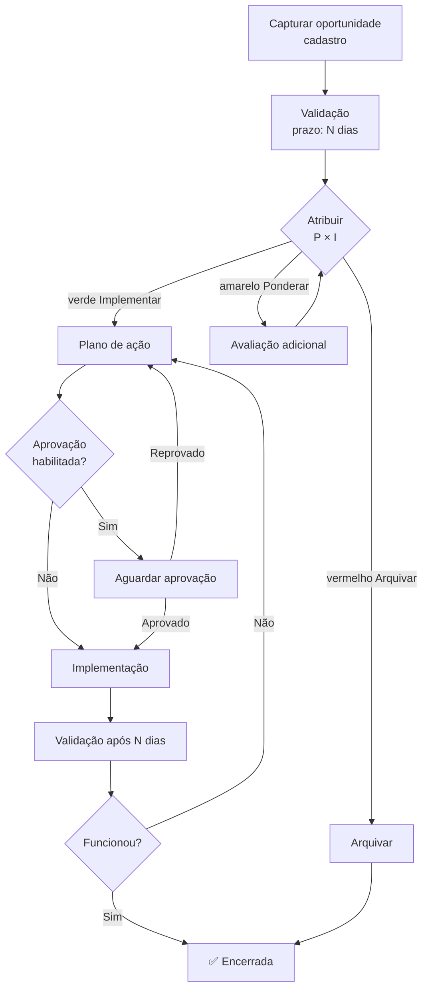
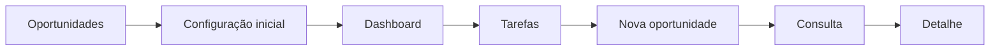

# Oportunidades — visão geral

Onde você captura **ideias de melhoria** e prioriza usando matriz **Probabilidade × Impacto**, decidindo Implementar / Ponderar / Arquivar.

## URL

`opp.qualyteam.com` (ou `opportunities.qualyteam.com`)

## Top-bar

```
[Logo] [Oportunidades ▾] [Dashboard] [Tarefas] [Nova oportunidade de melhoria] [Consulta]
```

| Aba | O que tem |
|---|---|
| **Dashboard** | Quantidade por quadrante, por unidade, status |
| **Tarefas** | Suas oportunidades pendentes (validação, plano, implementação) |
| **Nova oportunidade de melhoria** | Botão direto para cadastrar |
| **Consulta** | Lista mestra |

## ⭐ Configuração obrigatória antes do uso

Diferente de Documentos e NC, **você não pode cadastrar oportunidade sem antes ter configurado a matriz**. Se ainda não configurou, o sistema te leva direto para `/module-configuration`.

## A matriz Probabilidade × Impacto

Conceito: cada oportunidade recebe 2 notas (P e I). A combinação cai num **quadrante** com uma **ação recomendada**.

### Tamanhos disponíveis

- **3×3**: 9 quadrantes (mais simples, recomendado para começar)
- **4×4**: 16 quadrantes
- **5×5**: 25 quadrantes (mais granular)

### Ações nos quadrantes

| Cor | Ação | Quando |
|---|---|---|
| 🟢 verde | **Implementar** | Alta probabilidade de sucesso + Alto impacto positivo |
| 🟡 amarelo | **Ponderar** | Vale análise mais profunda antes de decidir |
| 🔴 vermelho | **Arquivar** | Baixa probabilidade ou baixo impacto — não vale o esforço |

### Exemplo de matriz 3×3 padrão

```
Probabilidade ↑
       ┌──────────┬──────────┬──────────┐
  Alta │ Ponderar │ Ponderar │Implementar│
       ├──────────┼──────────┼──────────┤
   Mod │ Arquivar │ Ponderar │ Ponderar │
       ├──────────┼──────────┼──────────┤
 Baixa │ Arquivar │ Arquivar │ Ponderar │
       └──────────┴──────────┴──────────┘
        Baixo     Moderado   Alto
                Impacto →
```

> Você pode **customizar 100%**: rótulos dos eixos, ações nos quadrantes, cores. A matriz acima é só sugestão.

## Fluxo



## Quando usar este módulo

- Funcionário sugeriu melhoria de processo.
- Caixa de sugestões da empresa.
- Análise crítica identificou ponto de melhoria.
- Auditoria recomendou (sem ser não-conformidade).
- Benchmarking apontou prática melhor de outra empresa.

> **Diferença chave para Não Conformidade**: aqui não houve **falha**. Aqui há uma **oportunidade** de melhorar algo que já funciona.

## Mapa das telas



## Permissões

| Permissão | Para quê |
|---|---|
| `opp.create` | Criar oportunidade |
| `opp.update` | Editar |
| `opp.read` | Ver Consulta |
| `opp.tasks.read_all` | Ver tarefas de outros |
| `opp.validate` | Atribuir P × I (validação) |
| `opp.config.update` | Editar configuração / matriz |
