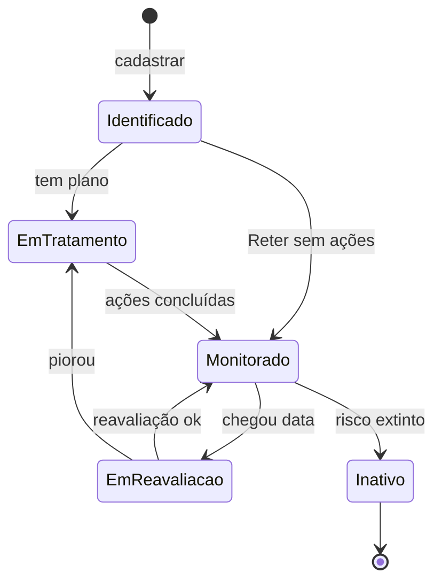

# Riscos — Identificar risco

## Onde fica

`Riscos → Tarefas → botão "Identificar risco"` (URL: `/risks/new`)

> Pré-requisito: a unidade onde você quer cadastrar o risco precisa **ter configuração ativa**. Se não tem, sistema te leva para `/units/configure` primeiro.

## Quem acessa

Geralmente: Responsável da unidade + Coord. Qualidade. Pode ser liberado para outros conforme política da empresa.

## O wizard (3 passos típicos)

```
            ┌── 1. Identificação ──┬── 2. Avaliação ──┬── 3. Tratamento ──┐
```

### Passo 1: Identificação do risco

```
Identificar risco
[1] Identificação ●  [2] Avaliação  [3] Tratamento

Unidade organizacional *  ⓘ
[ CT Caieiras                                                                ▾]
                                       ↑ filtra unidades com config ativa

Categoria *
[ Selecione                                                                   ▾]
   - Ambiental
   - Operacional
   - Saúde e Segurança
   - Legal/Regulatório
   - Financeiro
   - Reputação
   - Estratégico
   - Outro

Descrição do risco *
[ Vazamento de resíduo Classe I durante transbordo de bombona para tanque        ]
[ pode contaminar solo do pátio. ]
                                                                       100/3000

Causa potencial
[ Ergonomia inadequada do transbordo + ausência de bandeja de contenção         ]

Consequência potencial
[ Multa CETESB por contaminação de solo (R$ 50k+), interrupção de operação,    ]
[ exposição de operadores a Classe I. ]

Anexos
[ + Inserir anexos ]

[ Próximo ]
```

#### Cada campo

| Campo | O que é | Obrigatório? |
|---|---|---|
| Unidade | Unidade onde o risco existe (filtra para unidades com config) | ✅ |
| Categoria | Tipo de risco | ✅ |
| Descrição | O risco em si (texto factual) | ✅ |
| Causa potencial | Por que o risco existe / o que pode disparar | Recomendado |
| Consequência potencial | O que acontece se materializar | Recomendado |
| Anexos | Fotos, laudos, evidências | Opcional |

### Passo 2: Avaliação

```
[2] Avaliação ●

Probabilidade × Impacto
(usa matriz da unidade CT Caieiras)

Probabilidade *
⊙ Rara  ⊙ Possível  ⊙ Provável  ⊙ Quase certa

Impacto *
⊙ Insignificante  ⊙ Menor  ⊙ Moderado  ⊙ Crítico

  Probab.↑
         ┌────┬────┬────┬────┐
   Q.C.  │Mit.│Evit│Evit│Evit│
         ├────┼────┼────┼────┤
   Prov  │Ret.│Mit.│Evit│Evit│
         ├────┼────┼────┼────┤
   Poss  │Ret.│Ret.│Mit.│Evit│
         ├────┼────┼────┼────┤
   Rara  │Ret.│Ret.│Ret.│Mit.│
         └────┴────┴────┴────┘
          Insig Menor Mod Crít

  ✓ Sua avaliação cai em "Mitigar" 🟡
                  (Provável × Moderado)

Memorial / justificativa da avaliação
[ Operadores reportam quase-acidentes mensais (probabilidade alta).             ]
[ Impacto moderado porque a quantidade é controlada (até 200L por bombona).    ]

[ Voltar ]   [ Próximo ]
```

#### O que acontece

- Você avalia P × I.
- Sistema **destaca o quadrante** em tempo real e **mostra o tratamento sugerido** (Reter / Mitigar / Evitar).
- O memorial é importante para justificar a avaliação em auditoria.

### Passo 3: Tratamento

```
[3] Tratamento ●

Tratamento sugerido pelo apetite: Mitigar 🟡

Tratamento adotado *
⊙ Mitigar (sugerido)
⊙ Reter (justifique)
⊙ Evitar (justifique)

   ⓘ Você pode optar por tratamento diferente do sugerido. Em auditoria,
     a justificativa será verificada.

Justificativa (se diferente do sugerido):
[ ............................................................................ ]

────────────────────────────────────────────────────────────────────────

Plano de mitigação

[ + Adicionar ação ]

Ação 1
   Descrição: [ Instalar bandeja de contenção sob a área de transbordo         ]
   Responsável: [ Pedro Almoxarifado                                          ▾]
   Prazo: [ 30/06/2026 ]

Ação 2
   Descrição: [ Treinar operadores em técnica correta de transbordo            ]
   Responsável: [ RH (Maria Souza)                                            ▾]
   Prazo: [ 15/05/2026 ]

[ + Adicionar ação ]

Indicador de monitoramento
[ Número de quase-acidentes de transbordo por mês                              ]
Meta: [ ≤ 1 / mês ]

[ Voltar ]   [ Gravar risco ]
```

#### Tratamento adotado

- O tratamento **sugerido** vem da matriz da unidade.
- Você pode **escolher diferente** com justificativa formal.
- Reter (mesmo em quadrante "Mitigar") = aceitar consciente após análise.
- Evitar (mesmo em "Mitigar") = ser mais cauteloso.

#### Plano de mitigação

Lista de ações para reduzir probabilidade ou impacto:
- Cada ação tem responsável + prazo.
- Aparece nas Tarefas dos responsáveis (`/tasks/risks-in-treatment`).

#### Indicador de monitoramento

Métrica para acompanhar o risco. Útil para reavaliação futura: "o indicador melhorou ou piorou?".

## Botão Gravar risco

1. Risco criado com:
   - **Status**: "Em tratamento" (se tem plano) ou "Monitorado" (se Reter).
   - **Próxima reavaliação**: hoje + período configurado da unidade (ex: hoje + 6 meses).
2. Toast verde: "Risco RSK-007 cadastrado".
3. Redireciona para detalhe.
4. **Notificações**:
   - Responsável da unidade: e-mail + in-app.
   - Cada responsável de ação do plano: e-mail + in-app.

## Onde o risco aparece depois

- **Tarefas → Em tratamento**: do responsável da unidade.
- **Tarefas → Implementação** (de cada ação): dos responsáveis das ações do plano.
- **Consulta → Riscos**: lista mestra.
- **Dashboard**: heatmap.
- Após N meses: **Tarefas → Para reavaliação**.

## Estado pós-cadastro



## Estados especiais

### Unidade sem configuração
Bloqueado. "Configure a matriz da unidade primeiro."

### Riscos antigos sem indicador de monitoramento
Permitido (campo opcional). Mas em auditoria, pode ser questionado.

### Tratamento "Evitar" sem plano
Bloqueado. "Evitar exige plano de eliminação."

### Tratamento "Reter" com plano
Permitido (monitoramento + ações preventivas).

## Notificações

| Quando | Quem |
|---|---|
| Risco identificado | Responsável da unidade + admin |
| Plano criado | Responsáveis das ações |
| Ação com prazo < 7 dias | Responsável da ação |
| Ação concluída | Responsável da unidade |
| Risco mudou de quadrante para pior (na reavaliação) | Responsável + admin + gerência |

## Audit log

- `risk.identified`
- `risk.treatment.set`
- `risk.action.created` (uma por ação do plano)

## Permissões

| Ação | Permissão |
|---|---|
| Identificar | (default ou específica do tenant) |
| Editar enquanto em tratamento | responsável da unidade ou Coord. Qual. |
| Editar concluído | `risk.update_completed` |
| Excluir | `risk.delete` |

## Exemplo Seven — risco real

**Cenário**: Coord. ambiental identifica risco de derramamento durante transbordo no CT Caieiras.

**Passo 1 — Identificação**:
- Unidade: CT Caieiras
- Categoria: Ambiental
- Descrição: "Vazamento de resíduo Classe IIA durante transbordo bombona → tanque pode contaminar solo do pátio."
- Causa potencial: "Ergonomia inadequada + falta de bandeja de contenção"
- Consequência: "Multa CETESB R$ 50k+, embargo, exposição de operadores"
- Anexos: foto do pátio + relatório de quase-acidentes

**Passo 2 — Avaliação**:
- Probabilidade: Provável (3/4) — quase-acidentes mensais
- Impacto: Moderado (3/4) — quantidades controladas
- Quadrante: **Mitigar** 🟡
- Memorial: registrado.

**Passo 3 — Tratamento**:
- Tratamento adotado: Mitigar (igual ao sugerido)
- Plano:
  - AC-1: Instalar bandeja de contenção (Pedro, 30 dias)
  - AC-2: Treinar operadores (RH, 15 dias)
  - AC-3: Implementar checklist pré-transbordo (Carlos Op, 7 dias)
- Indicador: nº quase-acidentes/mês ≤ 1
- Próxima reavaliação: 6 meses (config da unidade Caieiras)

**Gravar**: RSK-007 criado. Pedro, Maria e Carlos veem ações em **Tarefas → Em tratamento**. Após 30 dias todas concluídas. Risco vai para **Monitorado**. Em 6 meses: aparece em **Para reavaliação**. João Operações reavalia: indicador caiu para 0.2/mês. Probabilidade muda para Possível. Quadrante agora é Reter. Risco fica como Monitorado, próxima reavaliação em mais 6 meses.
