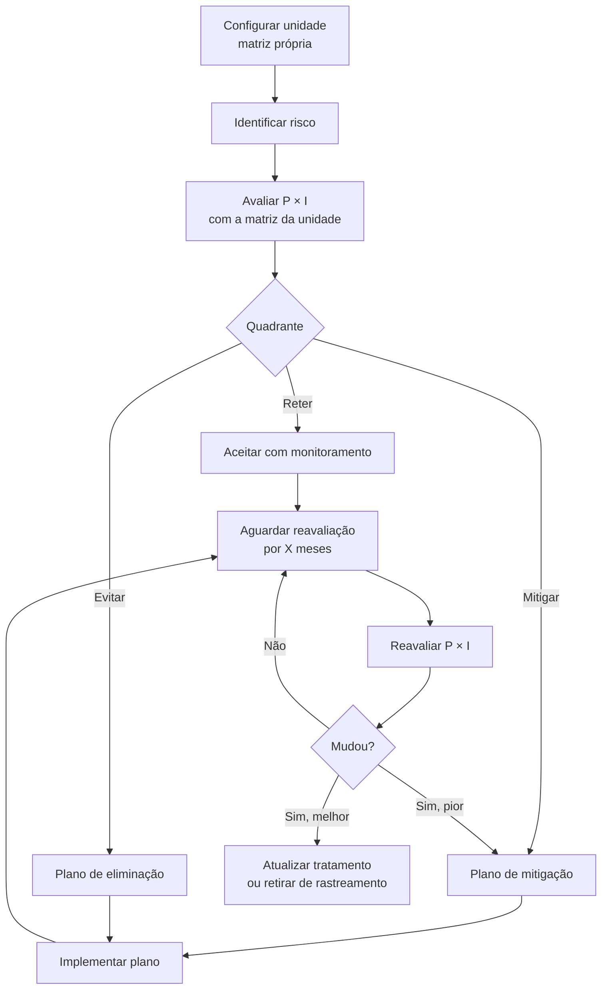
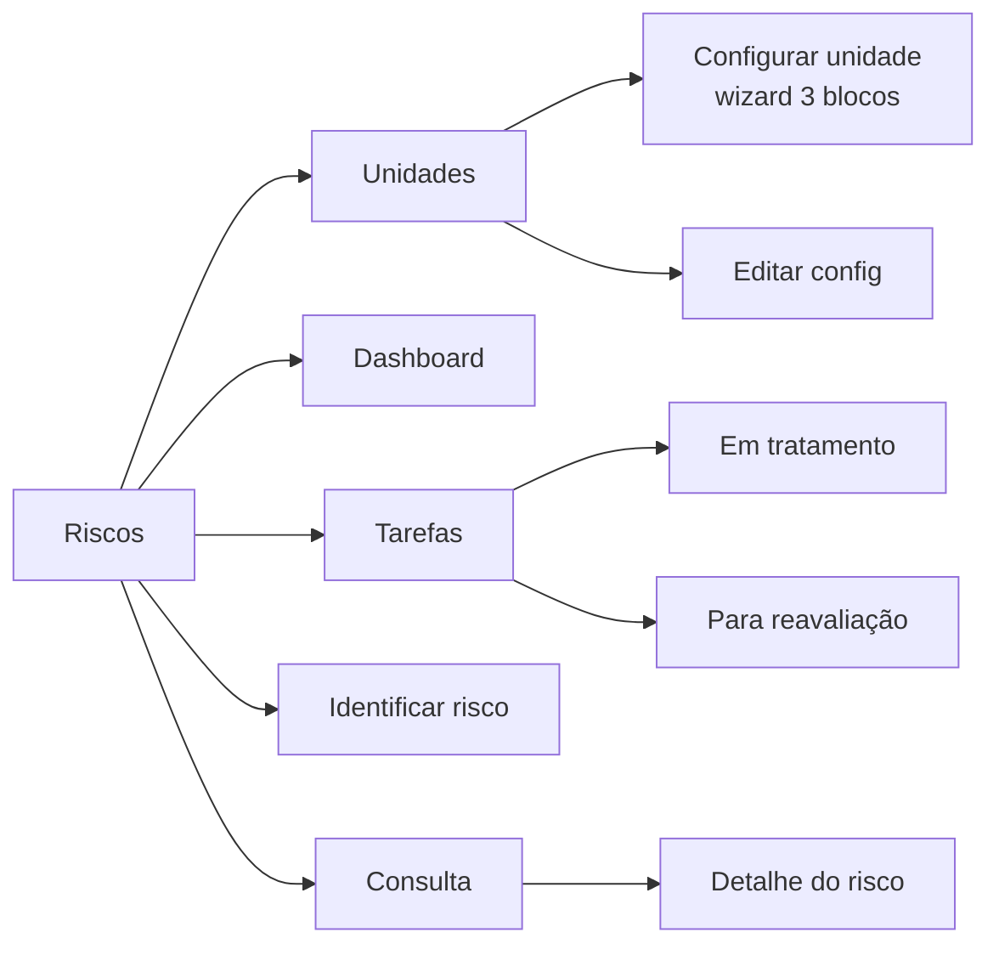

# Riscos — visão geral

Onde você gerencia **riscos** que possam afetar a empresa: ambientais, operacionais, financeiros, de saúde e segurança. Aderente à **ISO 31000**.

## URL

`risk.qualyteam.com` (ou `risks.qualyteam.com`)

## Top-bar

```
[Logo] [Riscos ▾] [Dashboard] [Tarefas] [Unidades] [Consulta]
```

| Aba | O que tem |
|---|---|
| **Dashboard** | Visão geral do tratamento e da matriz |
| **Tarefas** | Riscos em tratamento + Riscos para reavaliação |
| **Unidades** | ⭐ Configuração da matriz **POR unidade** |
| **Consulta** | Lista mestra |

## ⭐ Característica única deste módulo: configuração POR unidade

Diferente de Documentos / NC / Oportunidades, **cada Unidade Organizacional tem sua própria matriz de risco**.

Por que? Porque o **apetite ao risco** muda por unidade:
- Matriz administrativa (escritório central) → riscos diferentes de uma fábrica.
- Aterro CETESB → riscos ambientais altos com regulação rigorosa.
- Unidade comercial → riscos comerciais.

Cada unidade configura:
- Tamanho da matriz (3x3 / 4x4 / 5x5)
- Rótulos dos eixos
- Ações em cada quadrante (Reter / Mitigar / Evitar)
- Período de reavaliação
- Responsável pela unidade

## Matriz de risco padrão (ISO 31000)

```
Probabilidade ↑
       ┌──────────┬──────────┬──────────┐
  Alta │ Mitigar  │ Evitar   │ Evitar   │
       ├──────────┼──────────┼──────────┤
   Mod │ Reter    │ Mitigar  │ Evitar   │
       ├──────────┼──────────┼──────────┤
 Baixa │ Reter    │ Reter    │ Mitigar  │
       └──────────┴──────────┴──────────┘
        Baixo     Moderado   Alto
                Impacto →
```

### Tratamentos clássicos (ISO 31000)

| Tratamento | Cor | Quando usar |
|---|---|---|
| 🟢 **Reter** | Verde | Risco aceitável — apenas monitorar |
| 🟡 **Mitigar** | Amarelo | Reduzir probabilidade ou impacto com ações |
| 🔴 **Evitar** | Vermelho | Eliminar a fonte do risco completamente |
| (5x5) **Transferir** | (azul) | Passar para terceiro — seguro, contrato |
| (5x5) **Compartilhar** | (azul) | Dividir o risco com parceiros |

## Fluxo



## Mapa das telas



## Diferenças importantes para Oportunidades (que também usa matriz)

| | Oportunidades | Riscos |
|---|---|---|
| Foco | Melhorias positivas | Eventos negativos potenciais |
| Configuração da matriz | 1 matriz para a empresa toda | 1 matriz **por unidade** |
| Reavaliação periódica? | Não (uma análise só) | ✅ Sim (3/6/9/12 meses) |
| Tratamentos | Implementar / Ponderar / Arquivar | Reter / Mitigar / Evitar |
| Solicitante | Qualquer um | Geralmente Coord. ou Responsável da unidade |

## Fluxo inicial — primeiro uso

1. **Configurar a primeira unidade** em `/units/configure`.
2. **Identificar primeiro risco** em `/risks/new`.
3. Avaliar P × I → tratamento sugerido pelo apetite da unidade.
4. Plano de tratamento.
5. Implementar.
6. Após N meses (período de reavaliação), reavaliar.

## Permissões

| Permissão | Para quê |
|---|---|
| `risk.unit_config.create` | Configurar matriz de uma unidade |
| `risk.unit_config.update` | Editar configuração |
| `risk.unit_config.delete` | Excluir configuração |
| `risk.dashboard.read` | Ver Dashboard |
| `risk.toggle` | Inativar / reativar riscos |
| `risk.update_completed` | Editar riscos já encerrados |
| `risk.delete` | Excluir riscos (raríssimo) |
| (implícitas) | Identificar / tratar riscos da sua unidade |
